```{r, write_author_css, include = FALSE}
source("config/custom_css.R")
source("config/setup.R")
knitr::opts_chunk$set(out.width = "100%",
                      dev = "svg",
                      # cache = TRUE,
                      dev.args = list(family = "Roboto Condensed",
                                      bg = NA))

# set xaringanExtra
xaringanExtra::use_animate_css() # use animation
xaringanExtra::use_panelset() # use pannels
xaringanExtra::use_search(show_icon = TRUE) # search buttom
xaringanExtra::style_search(match_background = "blue")
xaringanExtra::use_tachyons() 
xaringanExtra::style_share_again(
  share_buttons = c("all")
)
xaringanExtra::use_broadcast()
xaringanExtra::use_scribble()


library(DT)
# Function to make HTML tables

print_table <- function(table, rownames = FALSE, digits = 3, ...){
  datatable(table, rownames = rownames, extensions = 'Buttons',
            options = list(scrollX = TRUE,
                           pageLength = 6,
                           dom = '<<t>Bp>',
                           buttons = c('copy', 'excel', 'print')), ...)}

```


```{r xaringanExtra, echo = FALSE}
xaringanExtra::use_progress_bar(color = "#0051BA", location = "bottom")
```


```{r echo = FALSE}
knitr::include_graphics ('figs/logos.png')
```


---
# Background

```{r warning=FALSE, message=FALSE, echo=FALSE}
library(metan)
library(tidyverse)

data <- read.csv("figs/DATA_MGIDI_V2.csv", sep = ";")
mat <- 
  data |> 
  mean_by(GEN) |> 
  select(-BLOCK) |> 
  column_to_rownames("GEN") |> 
  round_cols() 
head(mat, n = 20)
```


---
# Background
```{r echo = FALSE, out.width="100%"}
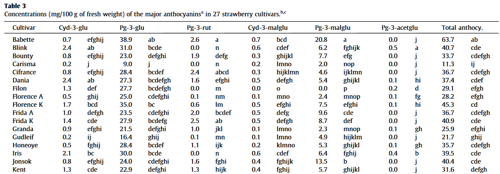
```

.tiny[
Aaby K, Mazur S, Nes A, Skrede G. Phenolic compounds in strawberry (Fragaria x ananassa Duch.) fruits: composition in 27 cultivars and changes during ripening. Food Chem. 2012;132(1):86–97. https://doi.org/10.1016/j.foodchem.2011.10.037
]

---
# Background
.lc-50[
```{r warning=FALSE, message=FALSE, out.width="75%"}
pca <-  prcomp(mat, scale. = TRUE)
library(factoextra)
fviz_screeplot(pca)
```

]


.rc-50[
```{r warning=FALSE, message=FALSE, out.width="85%"}
fviz_pca_biplot(pca, repel = TRUE)
```
]


---
# O índice MGIDI
```{r echo = FALSE, out.width="90%"}
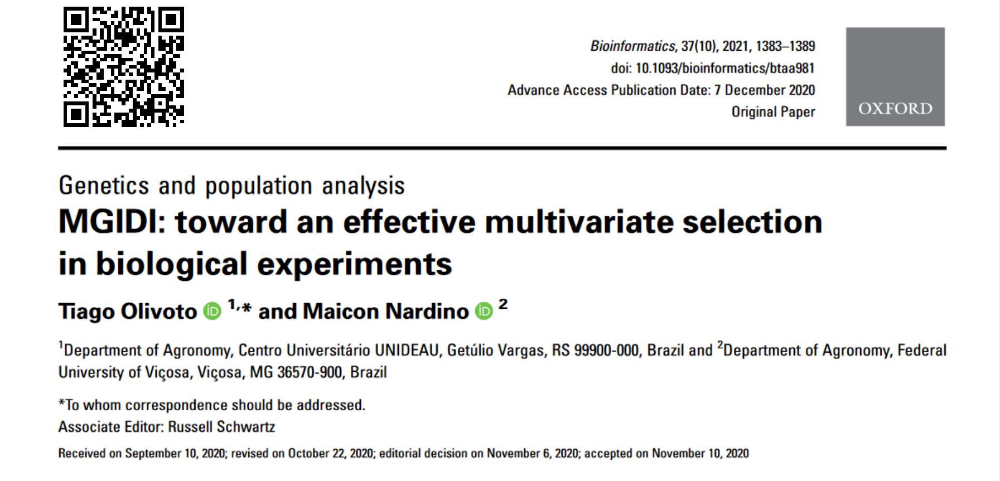
```


---
# Reescalonamento

.lc-50[
$r \mathbf{X}_{ij}=\frac{\eta_{nj}-\varphi_{nj}}{\eta_{oj}-\varphi_{oj}} \times( \theta_{ij}-\eta_{oj})+\eta_{nj}$

* $\eta_{nj}$ e $\varphi_{nj}$ são os novos máximos e mínimos para o caractere $j$, respectivamente;   

* $\eta_{oj}$ $\varphi_{oj}$ são os originais máximos e mínimos para o caractere $j$, respectivamente;   

* $\theta_{ij}$ é o valor original para o $j$-ésimo caractere do $i$-ésimo tratamento.

]

.rc-50[
```{r echo = FALSE, out.width="90%"}
resc <- mat |> resca() |> round_cols() |> select(contains("res")) |> as_tibble() |> select(1:7)
head(resc, n = 20)
```
]
---
# Análise de fatores


.lc-50[

$$
\mathbf{X}=\boldsymbol{\mu}+\mathbf{L f}+\varepsilon
$$

* $\mathbf{X}$ é um vetor p $\times$ 1 de observações reescalonadas;
* $\mu$ é um vetor p $\times$ 1 de médias padronizadas;
* $\mathbf{L}$ é uma matriz p $\times$ f de cargas fatoriais;
* $\mathbf{f}$ é um vetor p $\times$ 1 de fatores comuns;
* $\varepsilon$ é um vetor p $\times$ 1 de resíduos.
* $p$ e $f$ o número de caracteres e fatores comuns retidos, respectivamente.


```{r}
mod <- 
  mat |> 
  mgidi(ideotype = c(rep("l", 4), rep("h", 10)),
        verbose = FALSE)
```
]

--

.rc-50[
```{r}
mod$finish_loadings
```
]


---
# Distância Genótipo-Ideótipo

.lc-50[
$$
\mathbf{F}=\mathbf{Z}\left(\mathbf{A}^{\mathrm{T}} \mathbf{R}^{-1}\right)^{\mathrm{T}}
$$
* $\mathbf{F}$ é uma matriz *f* (fatores) $\times$ *g* (genótipos) com os escores fatoriais;
* $\mathbf{Z}$ é uma matriz *g* $\times$ *p* (caracteres) com as médias reescaladas padronizadas
* $\mathbf{A}$ é uma matriz $p \times f$ com as cargas canônicas
* $\mathbf{R}$ é uma matriz $p \times p$ com as correlações entre os caracteres

```{r}
(sg <- mod$scores_gen[1:3, ] |> column_to_rownames("GEN") |> as.matrix())
```

]

.rc-50[
$MGIDI_i=\left[\sum_{j=1}^f\left(\gamma_{i j}-\gamma_j\right)^2\right]^{0.5}$


```{r, out.width="85%"}
(si <- mod$scores_ide |> column_to_rownames("GEN") |> as.matrix())
(gen_ide <- sweep(sg, 2, si, "-"))

# índice MGIDI
apply(gen_ide, 1, function(x){sqrt(sum(x^2))}) |> sort(decreasing = FALSE)

```

]


---
# Pontos fortes e fracos

.lc-50[

$\omega_{ij}=\frac{\sqrt{D_{ij}^2}}{\sum_{j=1}^f \sqrt{D_{i j}^2}}$

onde $D^2_{ij}$ é a distância entre o $i$-ésimo genótipo e o ideótipo para o $j$-ésimo fator
```{r}
mod$contri_fac |> head()
```

]


.rc-50[
```{r, out.width="85%"}
plot(mod, type = "contribution")
```

]


---
# Importância dos caracteres na seleção?
.lc-50[
## MGIDI original 
```{r echo=FALSE}
df <- 
  g_simula(ngen = 5,
           nrep = 3,
           nvars = 3,
           seed = c(5, 2, 32)) %>% 
  mean_by(GEN) |> 
  column_to_rownames("GEN")
df
```

```{r warning=FALSE, message=FALSE}
equal_weigths <- mgidi(df, verbose = FALSE)
equal_weigths$MGIDI
```
]

.rc-50[
## Pesos para cada caractere
```{r warning=FALSE, message=FALSE}
df
wv2 <- mgidi(df,
             weights = c(1, 15, 1),
             verbose = FALSE)
wv2$MGIDI

```

.tiny[
Proposto por Olivoto et al. (2022)
]
]


---
# Algumas Aplicações...

```{r echo = FALSE, out.width="90%"}
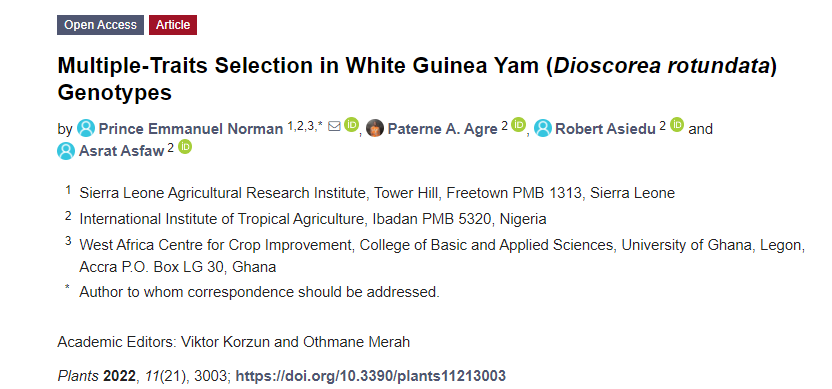
```


---
# Algumas Aplicações...

```{r echo = FALSE, out.width="90%"}
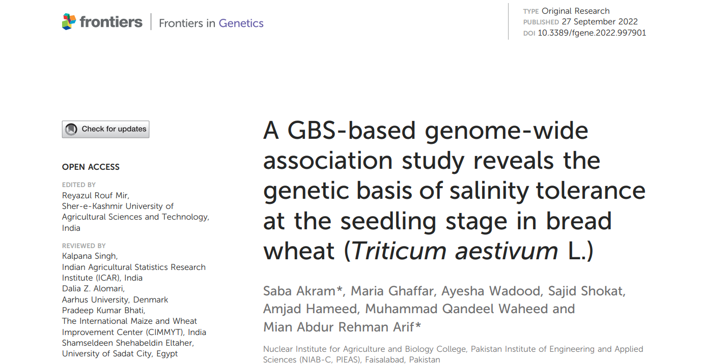
```


---
# Algumas Aplicações...

```{r echo = FALSE, out.width="90%"}

```


---
# Algumas Aplicações...

```{r echo = FALSE, out.width="90%"}
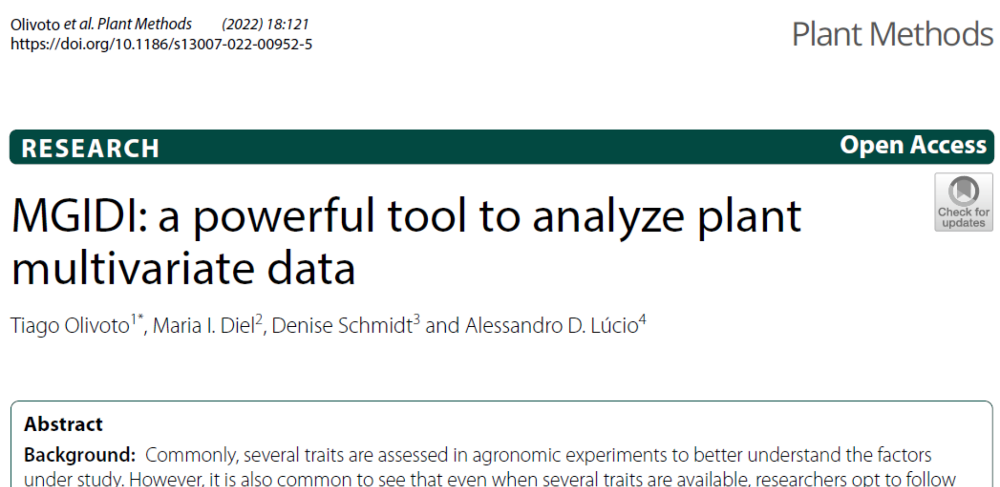
```


---
# Material e métodos

```{r echo = FALSE, out.width="90%"}
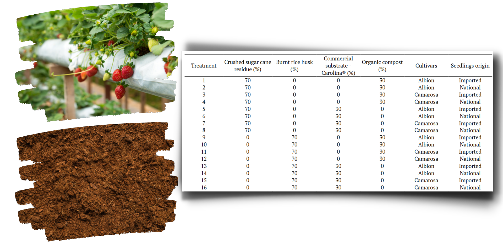
```


---
# Material e métodos
.lc-50[
* Análise de variância multivariada

$$
\mathbf{Y}=\mathbf{X} \mathbf{b}+\mathbf{e}
$$

* Fontes de variação significativas   
   - Matriz dupla entrada   
   - Valores preditos   
   - Índice MGIDI
]

.rc-50[
```{r echo = FALSE, out.width="100%"}
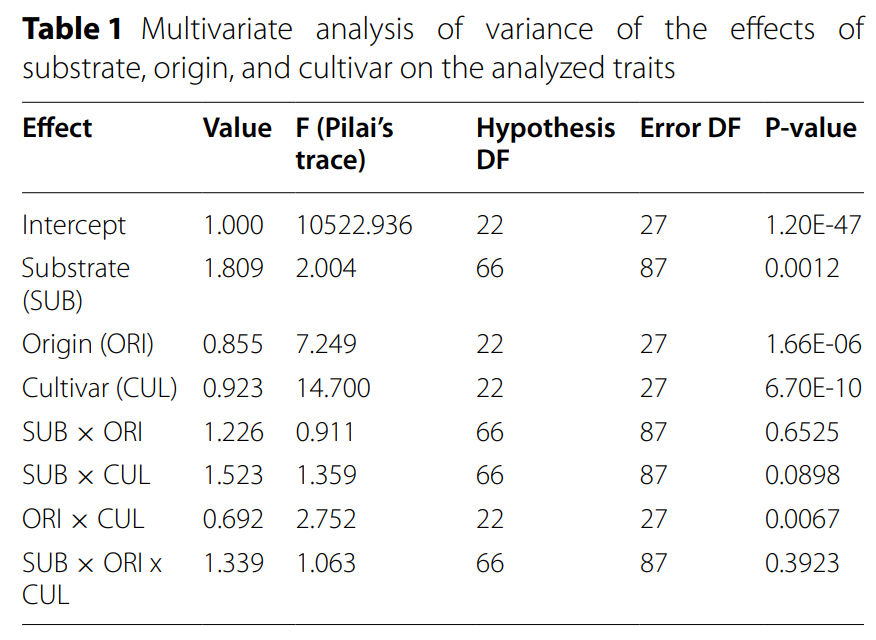
```

* Substrato
* Origem x cultivar
]


---
# Resultados e discussão

* Cargas fatoriais
```{r echo = FALSE, out.width="80%"}
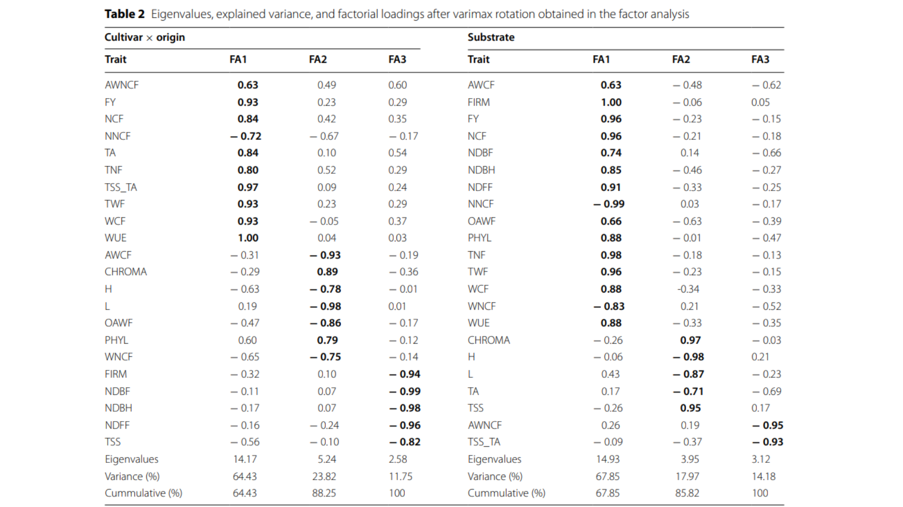
```


---
# Resultados e discussão

* Interação Cultivar x Origem

```{r echo = FALSE, out.width="90%"}
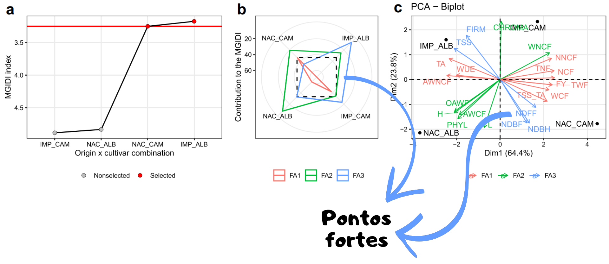
```


---
# Resultados e discussão

* Fator principal de substrato

```{r echo = FALSE, out.width="90%"}
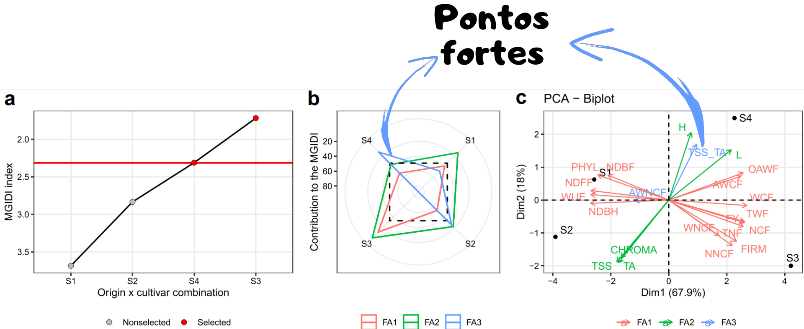
```


---
# Resultados e discussão

```{r echo = FALSE, out.width="90%"}
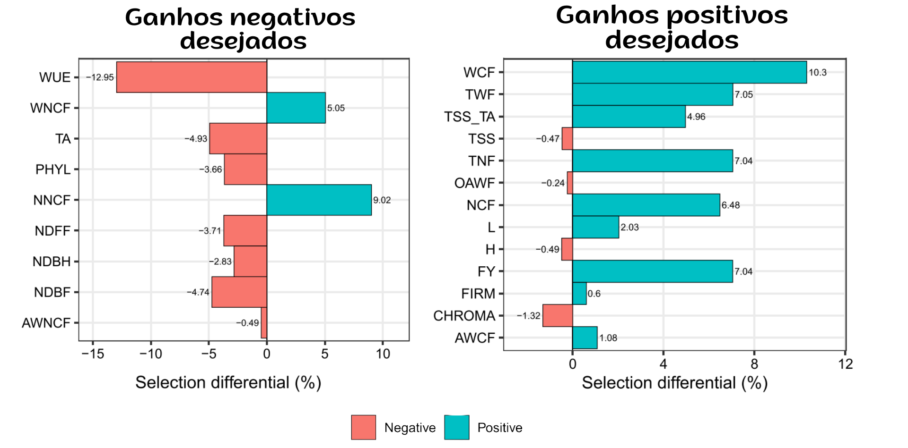
```


---
# Considerações finais
.lc-70[
* Ranqueamento de linhas com base em valores "desejados" de colunas
* O ponto chave do uso do MGIDI é a escolha do tratamento "ideal"
   - Atualmente (baseado nos dados)
   - Possível adaptação no vetor de ideótipos
   
* Fácil processo de ranqueamento comparado com PCA
* Visão dos pontos fortes e fracos
* Seleção divergente para caracteres positivamente correlacionados?
]

.rc-30[
```{r echo = FALSE, out.width="100%"}

```

]


---
class: center

# Em direção à uma efetiva seleção multivariada em experimentos biológicos

.lc-50[

<center>
</center>

<i class="far fa-envelope"></i> [tiago.olivoto@ufsc.com](mailto:tiago.olivoto@ufsc.com)<br>
<i class="fas fa-home"></i> [olivoto.netlify.app](https://olivoto.netlify.app/)<br>
<i class="ai ai-lattes ai"></i>[Lattes](http://lattes.cnpq.br/2432360896340086)<br>
<i class="ai ai-google-scholar ai"></i>[Scholar](https://scholar.google.com/citations?user=QjxIJkcAAAAJ&hl=pt-BR)<br>
<i class="ai ai-researchgate ai"></i>[Research Gate](https://www.researchgate.net/profile/Tiago_Olivoto2)<br>
<i class="fab fa-twitter"></i> [@tolivoto](https://twitter.com/tolivoto)<br>
<i class="fab fa-github-square"></i> [GitHub](https://github.com/TiagoOlivoto)

]

.rc-50[

.huge[
Obrigado!
]


Slides produzidos com os 📦 R
.tiny[
[**xaringan**](https://github.com/yihui/xaringan )<br>
[**xaringanExtra**]( https://github.com/gadenbuie/xaringanExtra)<br>
<i class =" fas fa-code "></i> Veja o código no [GitHub](https://github.com/TiagoOlivoto/slides_R)<br>
[**Imagem de fundo**](https://web.archive.org/web/20161028162317/http://www.panoramio.com/photo/99521842)
]<br>


```{r echo = FALSE, out.width='100%'}

```


]

<!-- inicio academic icons -->
<link rel="stylesheet" href="https://cdn.jsdelivr.net/gh/jpswalsh/academicons@1/css/academicons.min.css">
<!-- final academic icons -->


<!-- inicio font awesome -->
<script src="https://kit.fontawesome.com/1f72d6921a.js" crossorigin="anonymous"></script>
