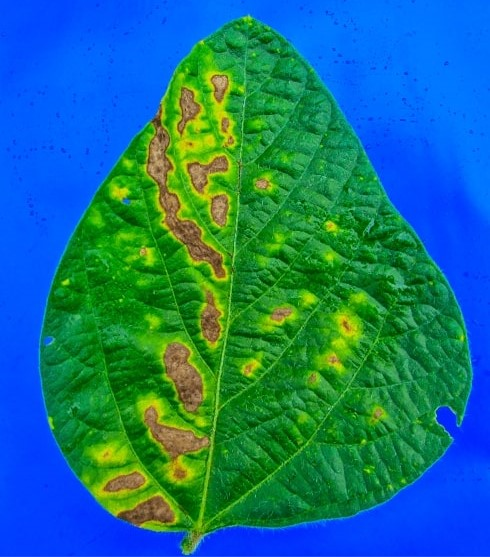
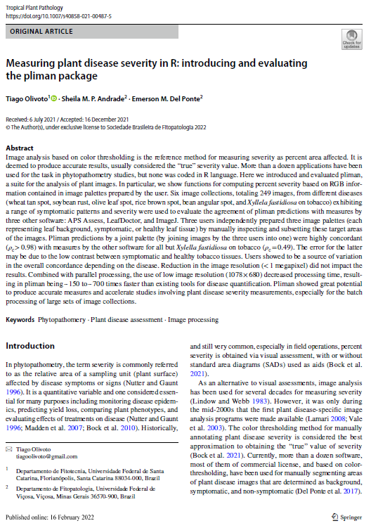
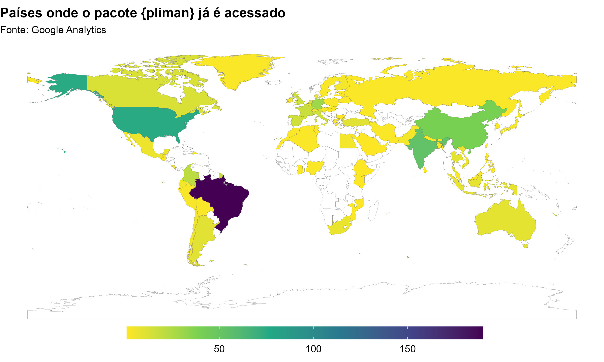
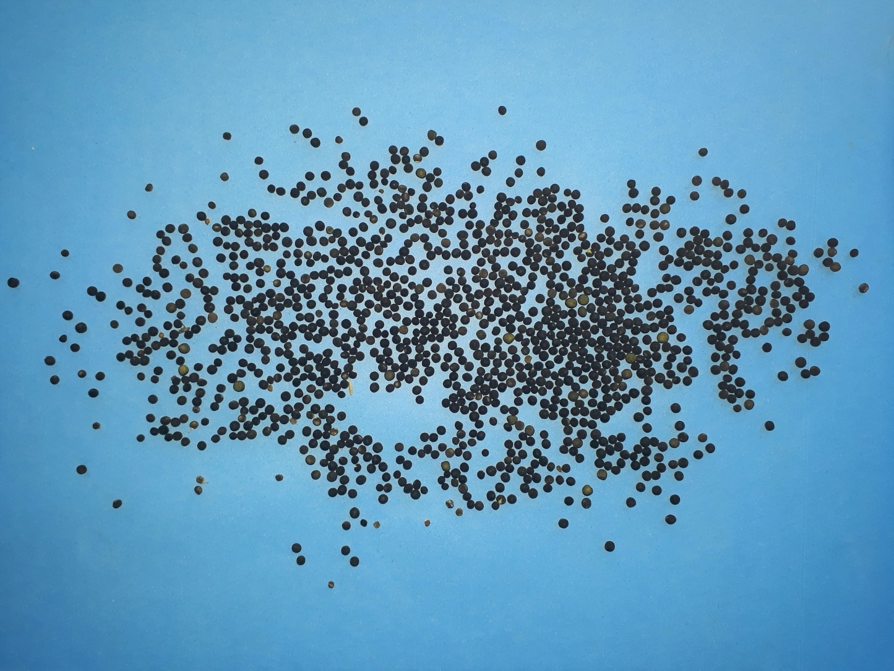

```{r, write_author_css, include = FALSE}
source("config/custom_css.R")
source("config/setup.R")
knitr::opts_chunk$set(out.width = "100%",
                      dev = "svg",
                      # cache = TRUE,
                      dev.args = list(family = "Roboto Condensed",
                                      bg = NA))

# set xaringanExtra
xaringanExtra::use_animate_css() # use animation
xaringanExtra::use_panelset() # use pannels
xaringanExtra::use_search(show_icon = TRUE) # search buttom
xaringanExtra::style_search(match_background = "blue")
xaringanExtra::use_tachyons() 
xaringanExtra::style_share_again(
  share_buttons = c("all")
)
xaringanExtra::use_broadcast()
xaringanExtra::use_scribble()
```


# Breaking the ice


* Why do we make research?
--

* What is the problem to be solved?
--

* Have we a relevant gap to fill?
--

* What have others done?
--

* How can we fill that gap?
--

* Can we definitively fill that gap?


---

# The problem

.lc-70[
```{r, out.width='60%', echo = FALSE}

```

]
.rc-30[
* What is the area of such a leaflet?
* How much 'diseased' is such a leaflet?
* How many leaflet do we need to evaluate?
]


---

# Have we a relevant gap to fill?

.lc-30[
* Nearly one to three minutes per image
* Low scale in the data collection
* How about data processing?
* How about data presentation?

]

.rc-70[
```{r, out.width='85%', echo = FALSE}
knitr::include_graphics('figs/quant.png')
```

]


---
# What have others done?

.lc-50[
* ImageJ (Free and open-source)
* APS Assess ($295.00)
   - iterative section
* Easy Leaf Area (Python)
* Lamina (Java)
* LeafArea (R)
   - How about number and shape?

* Why not collect data, analyze data, and display the results in a single software?
]


.rc-50[
```{r, out.width='83%', echo = FALSE}

```

]


---

# How can we fill that gap?
## Digital images are composed of image elements (pixels)

```{r, out.width='60%', echo = FALSE, fig.cap=""}
knitr::include_graphics('figs/scheme_pixels.png')
```


---
# The RGB color space 

```{r, out.width='80%', echo = FALSE, fig.cap=""}
knitr::include_graphics('figs/scheme_rgb_leaf.png')
```


---
# Images are interpreted as arrays (arrays)

.lc-50[
```{r, out.width='75%', echo = TRUE, fig.cap=""}
library(pliman)
img <- image_pliman("sev_leaf.jpg")
dim(img)
pixels <- img@.Data[1:2, 1:2, 1:3]
pixels
```
]

.rc-50[
```{r out.width='75%'}
plot(img)
```
]


---
# Arrays can be handled in R!


.panelset.sideways.left[
.panel[.panel-name[Image importation]
```{r, out.width='65%'}
sev <- image_pliman("sev_leaf.jpg", plot = TRUE)
```

]

.panel[.panel-name[Thresholding]

.lc-50[
* Pixel density (**B**)
```{r out.width='90%'}
ind <-
  image_index(sev,
              index = "B",
              show_image = FALSE)
plot(ind, type = "density")

```

]


.rc-50[
* A *Raster* plot
```{r, out.width='90%'}
plot(ind, type = "raster")
```

]
]


.panel[.panel-name[Segmentation]
.lc-50[
```{r, out.width='100%'}
image_index(sev, index = "B")
```

]
.rc-50[
```{r, out.width='100%'}
image_segment(sev, index = "B")
```
]

]

.panel[.panel-name[Indexes for segmentation]
```{r echo=FALSE}
library(DT)
# Function to make HTML tables

print_table <- function(table, rownames = FALSE, digits = 3, ...){
  datatable(table, rownames = rownames, extensions = 'Buttons',
            options = list(scrollX = TRUE,
                           dom = '<<t>Bp>',
                           buttons = c('copy', 'excel', 'print')), ...)}

ind <- read.csv(file = system.file("indexes.csv",
                                   package = "pliman",
                                   mustWork = TRUE),
                header = T,
                sep = ";")
print_table(ind[,1:2])
```

]


.panel[.panel-name[Choosing an index]
```{r, out.width='100%', fig.width=20, fig.height=13}
image_segment(sev, index = "all", ncol = 6)
```

]


.panel[.panel-name[Segmented image]

.lc-33[
```{r, out.width='100%'}
image_segment(
  sev,
  index = "NB",
  threshold = 0.3
)
```

]
.lc-33[
```{r, out.width='100%'}
image_segment(
  sev,
  index = "NB",
  threshold = 0.5
)
```

]
.lc-33[
```{r, out.width='100%'}
image_segment(
  sev,
  index = "NB",
  threshold = 0.7
)
```

]


* When `threshold` is `NULL` (default), the Otsu's (1979) method is used.

.tiny[
.bg-transparent.b--blue.ba.bw2.br3.shadow-5.ph2.mt2[
*An optimal threshold is selected by the discriminant criterion, namely, so as to maximize the separability of the resultant classes in gray levels* (Outsu, 1979)
]
]
]
]


---
# <i class="fas fa-glasses"></i> The package workflow


```{r, out.width='85%', echo = FALSE, fig.cap=""}
knitr::include_graphics('figs/workflow_pliman.png')
```


---

# <i class="fa fa-book"></i> References


.lc-50[
```{r, out.width='50%', echo = FALSE}
knitr::include_graphics('figs/paper_mee.png')
```
<i class="fa fa-book"></i>See the paper here! [aqui](https://www.researchgate.net/publication/357909074_Lights_camera_pliman_An_R_package_for_plant_image_analysis)
]

.rc-50[
```{r, out.width='50%', echo = FALSE}

```
<i class="fa fa-book"></i>See the paper here! [aqui](https://www.researchgate.net/publication/358646216_Measuring_plant_disease_severity_in_R_introducing_and_evaluating_the_pliman_package)
]


# <i class="fas fa-glasses"></i> 

.lc-80[
```{r, out.width='90%', echo = FALSE}

```

]

.rc-20[
```{r, out.width='100%', echo = FALSE}
knitr::include_graphics('figs/qrcode_pliman.png')
```

[Site do pacote](https://tiagoolivoto.github.io/pliman/)
]


---
.lc-50[
# Original image
```{r, out.width='50%', echo = FALSE}
knitr::include_graphics('figs/soybean_rust.png')
```

]

.rc-50[
# Processed image
```{r, out.width='50%', echo = FALSE, fig.cap="Estimated severity: 17.69%"}
knitr::include_graphics('figs/soybean_rust_mask.png')
```

]


---

.lc-50[
# Counting objects (vetch seeds)
```{r, out.width='85%', echo = FALSE}
img <- image_import("figs/vicia.jpg")


```
]

--

.rc-50[
```{r, out.width='85%'}
vicia <- analyze_objects(img, index = "B")
vicia$statistics[1,]
```
]


---
.lc-50[
# Leaf area
```{r, out.width='80%', echo = FALSE}
la <- image_import("figs/leaves.jpg", plot = TRUE)

```
]

--

.rc-50[
```{r, out.width='80%'}
la_res <-
  analyze_objects(la,
                  watershed = FALSE,
                  marker = "area",
                  col_background = "blue")
area <- get_measures(la_res, dpi = 72)
plot_measures(area,
              measure = "area",
              vjust = -30)
```
]


---
# Shape of objects

.lc-50[
```{r out.width="75%", echo=T}
leaves <- image_import("figs/leaves2.jpg", plot = TRUE)
```
]

.rc-50[
```{r out.width="80%", echo=TRUE, eval=FALSE}
laf_meas <-
  analyze_objects(leaves,
                  watershed = FALSE,
                  contour_size = 3,
                  col_background = "black")

```


```{r out.width="75%", echo=FALSE}
bean2_meas <-
  analyze_objects(leaves,
                  watershed = FALSE,
                  contour_size = 3,
                  col_background = "black")
# contour
cont <- object_contour(leaves,
                       watershed = FALSE,
                       show_image = FALSE)
# smooth the perimeter with fewer vertices (50)
sp <- poly_smooth(cont, plot = FALSE)


# center of mass
cm <- poly_mass(sp)
plot_mass(cm,
          col = "white",
          arrow = TRUE)
meas <- get_measures(bean2_meas, dpi = 150)
plot_measures(meas, measure = "length", vjust = 50)
plot_measures(meas, measure = "width", hjust = 50)
plot_measures(meas, measure = "id", hjust = -60, vjust = 60, col = "red")
```

]


---
# How many measures can we get?

```{r echo=FALSE}
print_table(meas)
```


---
# The positive things behind a denied paper

* June 11, 2021
   - First submission

--
* August 12, 2021
   - *I regret to inform you that we are unable to publish your paper...*
   - *...however, we would be willing to consider a new manuscript which takes into consideration the feedback you have received*

--
* November 10, 2021
   - New version of package
   - New version of paper
   - Resubmission

--
* December 16, 2021
   - *It is a pleasure to accept your manuscript...*


---
# Is the gap definitively filled?

* Still a long way to go
* Adaptative thresholding?
* Semantic segmentation?
* Convolutional Neural Networks


---
class: center

# Automatic image analysis for functional traits & disease measurement in R


.lc-50[

<center>
</center>

<i class="far fa-envelope"></i> [tiago.olivoto@ufsc.com](mailto:tiago.olivoto@ufsc.com)<br>
<i class="far fa-envelope"></i> [tiagoolivoto@gmail.com](mailto:tiagoolivoto@gmail.com)<br>
<i class="fas fa-home"></i> [olivoto.netlify.app](https://olivoto.netlify.app/)<br>
<i class="ai ai-lattes ai"></i>[Lattes](http://lattes.cnpq.br/2432360896340086)<br>
<i class="ai ai-google-scholar ai"></i>[Scholar](https://scholar.google.com/citations?user=QjxIJkcAAAAJ&hl=pt-BR)<br>
<i class="ai ai-researchgate ai"></i>[Research Gate](https://www.researchgate.net/profile/Tiago_Olivoto2)<br>
<i class="fab fa-twitter"></i> [@tolivoto](https://twitter.com/tolivoto)<br>
<i class="fab fa-github-square"></i> [GitHub](https://github.com/TiagoOlivoto)

]

.rc-50[

.Huge[
See you soon!
]

Slides made with the R 📦
.tiny[
[**xaringan**](https://github.com/yihui/xaringan)<br>
[**xaringanthemer**](https://github.com/gadenbuie/xaringanthemer)<br>
[**xaringanExtra**](https://github.com/gadenbuie/xaringanExtra)<br>
[**knitr**](http://yihui.name/knitr)<br>
[**R Markdown**](https://rmarkdown.rstudio.com) <br>
<i class="fas fa-code"></i> See the code at [GitHub](https://github.com/TiagoOlivoto/slides_R)
]


.tiny[
.bg-transparent.b--blue.ba.bw2.br3.shadow-5.ph2.mt2[
*“If you're curious, regardless of gender, race, and social strata, then you might be a scientist.”*
.tr[
— [Barbara McClinton](http://usp.br/cienciaweb/2019/05/barbara-mcclintock-o-milho-e-o-premio-nobel/)
]
]
]
]


<!-- inicio academic icons -->
<link rel="stylesheet" href="https://cdn.jsdelivr.net/gh/jpswalsh/academicons@1/css/academicons.min.css">
<!-- final academic icons -->


<!-- inicio font awesome -->
<script src="https://kit.fontawesome.com/1f72d6921a.js" crossorigin="anonymous"></script>
