```{r, write_author_css, include = FALSE}
source("config/custom_css.R")
source("config/setup.R")
knitr::opts_chunk$set(out.width = "100%",
                      dev = "svg",
                      # cache = TRUE,
                      dev.args = list(family = "Roboto Condensed",
                                      bg = NA))

# set xaringanExtra
xaringanExtra::use_animate_css() # use animation
xaringanExtra::use_panelset() # use pannels
xaringanExtra::use_search(show_icon = TRUE) # search buttom
xaringanExtra::style_search(match_background = "blue")
xaringanExtra::use_tachyons() 
xaringanExtra::style_share_again(
  share_buttons = c("all")
)
xaringanExtra::use_broadcast()
xaringanExtra::use_scribble()
```


# Tiago Olivoto

.lc-50[
## Formação
* Técnico em Agropecuária (2008)
* Agronomia (2014)
* Mestrado em Agronomia (2017)
* Doutorado em Agronomia (2019)

## Atuação profissional
* Técnico Agrícola (2008-2012)
* Vendedor Técnico (2013)
* Secretário Municipal de Agricultura (2014)
* Professor (2019-)
]


.rc-50[
<center>
</center>

.center[
<i class="far fa-envelope"></i> [tiago.olivoto@gmail.com](mailto:tiago.olivoto@gmail.com)<br>
<i class="fas fa-home"></i> [olivoto.netlify.app](https://olivoto.netlify.app/)<br>
<i class="ai ai-lattes ai"></i>[Lattes](http://lattes.cnpq.br/2432360896340086)<br>
<i class="ai ai-google-scholar ai"></i>[Scholar](https://scholar.google.com/citations?user=QjxIJkcAAAAJ&hl=pt-BR)<br>
<i class="ai ai-researchgate ai"></i>[Research Gate](https://www.researchgate.net/profile/Tiago_Olivoto2)<br>
<i class="fab fa-twitter"></i> [@tolivoto](https://twitter.com/tolivoto)<br>
<i class="fab fa-github-square"></i> [GitHub](https://github.com/TiagoOlivoto)
]
]


---
# Motivação

.lc-30[
* Automatização de processos   
   - Severidade de doenças
   - Número de grãos
   - Forma dos grãos
* Software gratuito/open-source
* Processamento em lote
* Paralelização
* Reprodutibilidade
]

.rc-70[
```{r, out.width='95%', echo = FALSE}
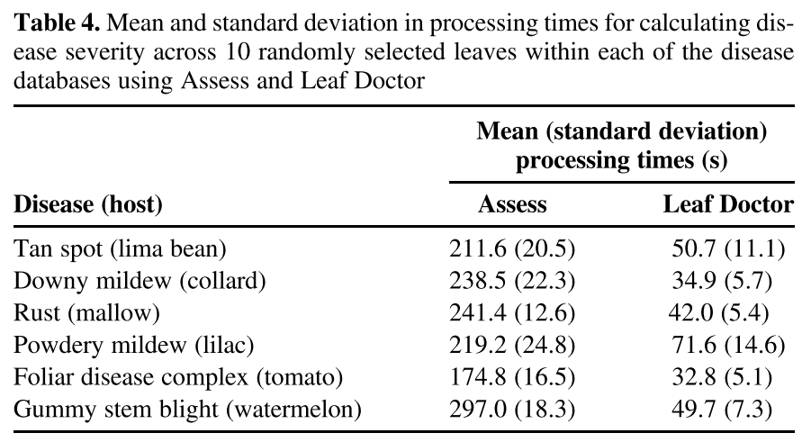
```
http://dx.doi.org/10.1094/PDIS-03-15-0319-RE
]


---

# <i class="fas fa-glasses"></i> O pacote {pliman}


{pliman} (**pl**ant **im**age **an**alysis) foi concebido para analisar (também) imagens de plantas, especialmente relacionadas à análise de folhas e sementes.  O pacote irá ajudá-lo a:

* Mensurar a severidade de doenças foliares;
* Contar o número de lesões;
* Obter características da forma das lesões;
* Contar objetos em uma imagem;
* Obter características de objetos (área, perímetro, raio, circularidade, excentricidade, solidez);
* Obter os valores RGB para cada objeto em uma imagem;
* Obter as coordenadas de objetos;
* Obter os contornos de objetos;
* Obter o *convex hull*;
* Isolar objetos;
* Plotar medidas de objetos.

{pliman} também fornece funções úteis para [transformação](https://tiagoolivoto.github.io/pliman/reference/utils_transform.html), [binarização](https://tiagoolivoto.github.io/pliman/reference/ image_binary.html), [segmentação](https://tiagoolivoto.github.io/pliman/reference/image_segment.html) e [resolução](https://tiagoolivoto.github.io/pliman/reference/utils_dpi.html ) de imagens.

---
# <i class="fas fa-glasses"></i> O pacote {pliman}


```{r, out.width='85%', echo = FALSE, fig.cap="Funções do pacote"}
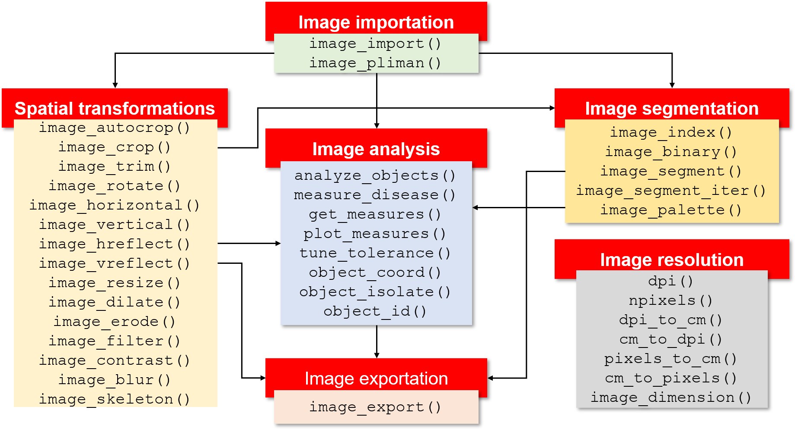
```


---
class: center

# <i class="fas fa-glasses"></i> O pacote {pliman}

```{r, out.width='70%', echo = FALSE}
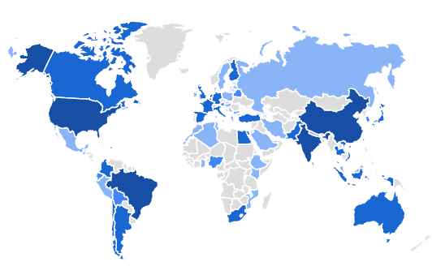
```

https://tiagoolivoto.github.io/pliman/


---
# Instalação

```{r eval=FALSE}
install.packages("pliman")
```

Ou instale a versão de desenvolvimento (**RECOMENDADA**) do pliman do [GitHub](https://github.com/TiagoOlivoto/pliman) com o comando abaixo. Note que o pacote `devtools` é necessário.

```{r, eval = FALSE}
# instalação do github
if(!require(devtools)){
  install.packages("devtools")
}
install_github ("TiagoOlivoto/pliman")

```

Depois de instalado, carregue o pacote com
```{r}
library(pliman)
```

.tiny[
.bg-transparent.b--blue.ba.bw2.br3.shadow-5.ph2.mt2[
Se você for um usuário do Windows, sugere-se primeiro baixar e instalar a versão mais recente do [Rtools](https://cran.r-project.org/bin/windows/Rtools/).
]
]


---

# Imagens são compostas por elementos de imagem (pixels)

```{r, out.width='80%', echo = FALSE, fig.cap=""}
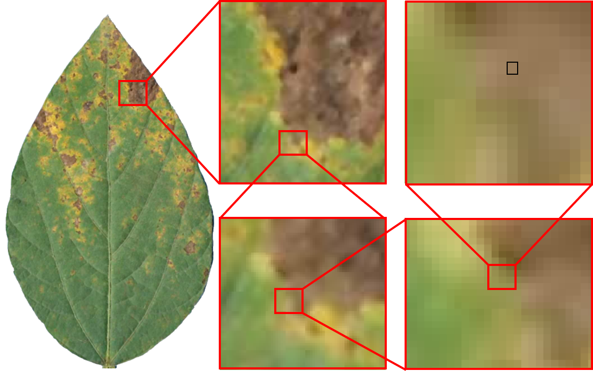
```

---
# Imagens são interpretadas como matrizes (arrays)

.lc-50[
```{r, out.width='75%', echo = TRUE, fig.cap=""}
img <- image_pliman("sev_leaf.jpg")
dim(img)
pixels <- img@.Data[1:3, 1:3, ]
pixels
```
]

.rc-50[
```{r out.width='90%'}
plot(img)
```

]


---
# O espaço de cores RGB
```{r, out.width='45%', echo = FALSE}
knitr::include_graphics('figs/additive_colors.png')
```

Fonte: https://bit.ly/3AKlIOQ


---
# O espaço de cores RGB

**R**ed | **G**reen | **B**lue


```{r, out.width='90%', echo = FALSE, fig.cap=""}
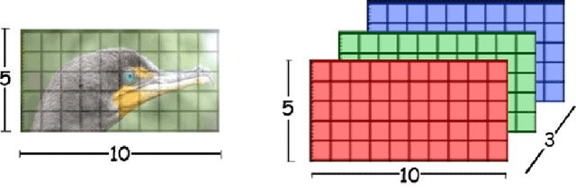
```

Fonte: https://bit.ly/3ufaBec


---
# O espaço de cores RGB

```{r, out.width='90%', echo = FALSE, fig.cap=""}
knitr::include_graphics('figs/scheme_rgb_leaf.png')
```


---
# Binarização
.lc-50[
* `image_index()` produz imagem em escala de cinza;
* `image_binary()` produz uma imagem binária (preto e branco);
* `image_segment()` segmenta objetos de uma imagem;
* `image_segment_iter()` segmenta objetos de uma imagem iterativamente.
]

.rc-50[
```{r, out.width='70%', echo = FALSE, fig.cap="Os estágios na estimativa da severidade da doença das plantas por avaliadores visuais e por análise de imagem por meio de um sensor (Bock et al. 2021)"}
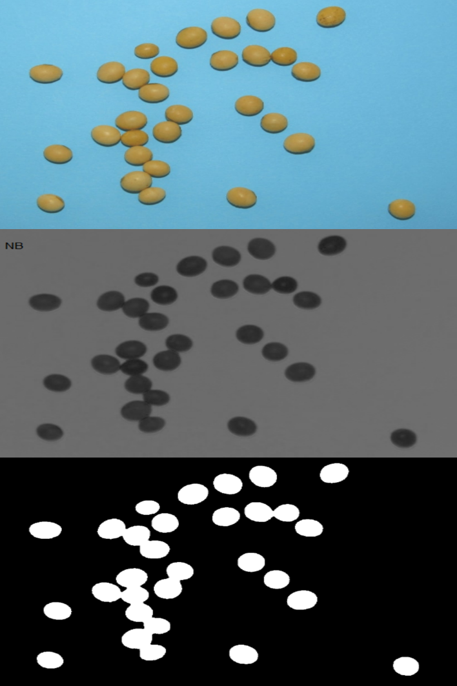
```
]


---
# Binarização
.lc-50[
```{r segmentation}
soy <- image_pliman("soybean_touch.jpg", plot = TRUE)

```
]

.rc-50[
```{r segmentation1, out.width="90%"}
image_binary(soy, ncol = 2)
```
]


---

# Fitopatometria
```{r, out.width='70%', echo = FALSE, fig.cap="Os estágios na estimativa da severidade da doença das plantas por avaliadores visuais e por análise de imagem por meio de um sensor (Bock et al. 2021)"}
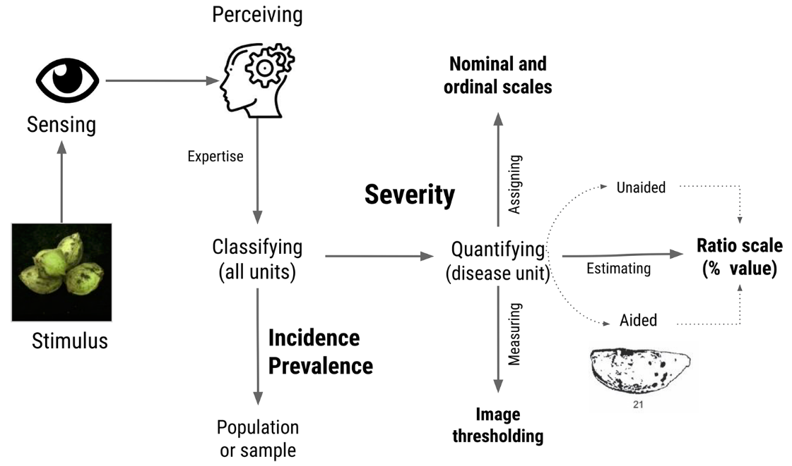
```


---

## Desafio

### Qual a *severidade* estimada na imagem abaixo?

.lc-30[
```{r, out.width='80%', echo = FALSE}
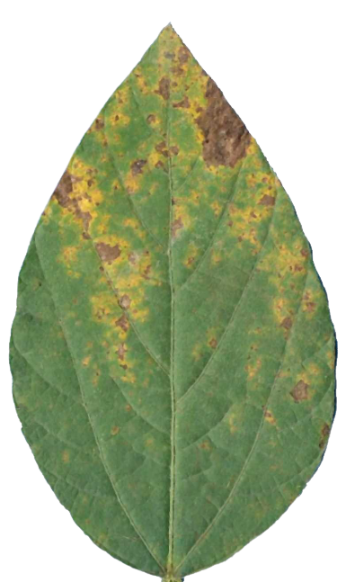
```

]

--

.rc-70[
```{r, out.width='100%', echo = FALSE, fig.cap="Diagramas de área padrão para ferrugem da soja (Franceschi et al. 2020)"}
knitr::include_graphics('figs/soybean_rust_sad.png')
```


]


---
# Estratégias para quantificação via software
## Modelos preditivos

```{r, out.width='65%', echo = FALSE, fig.cap="Etapas principais do processo de quantificação da severidade utilizando o pacote pliman baseado em um modelo preditivo (Olivoto et al. 2021)"}
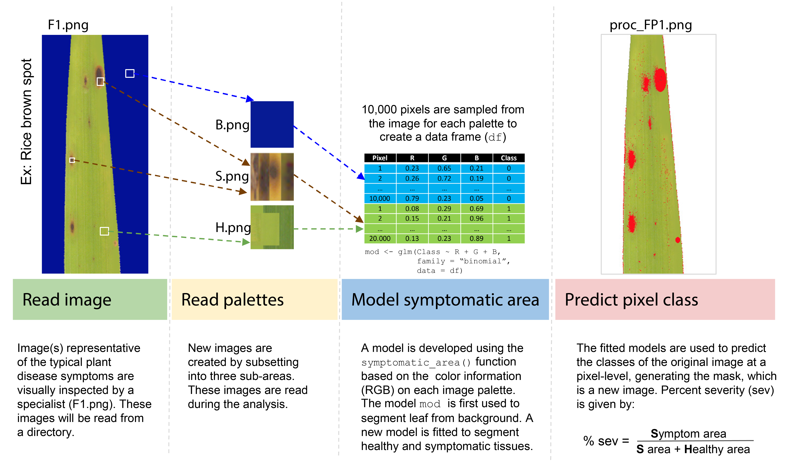
```


---
## Thresholding (limiar)


.panelset.sideways.left[
.panel[.panel-name[Aquisição da imagem]
```{r, out.width='75%'}
sev <- image_pliman("sev_leaf.jpg", plot = TRUE)
```

]

.panel[.panel-name[Thresholding]

.lc-50[
* Densidade dos valores de **B**
```{r out.width='100%'}
ind <-
  image_index(sev,
              index = "B",
              show_image = FALSE)
plot(ind, type = "density")

```

]


.rc-50[
* Gráfico *Raster*
```{r, out.width='100%'}
plot(ind, type = "raster")
```

]
]


.panel[.panel-name[Segmentação]
.lc-50[
```{r, out.width='100%'}
image_index(sev, index = "B")
```

]
.rc-50[
```{r, out.width='100%'}
image_segment(sev, index = "B")
```
]

]

.panel[.panel-name[Índices para segmentação]
```{r echo=FALSE}
library(DT)
# Function to make HTML tables

print_table <- function(table, rownames = FALSE, digits = 3, ...){
  datatable(table, rownames = rownames, extensions = 'Buttons',
            options = list(scrollX = TRUE, 
                           dom = '<<t>Bp>',
                           buttons = c('copy', 'excel', 'print')), ...)}

ind <- read.csv(file = system.file("indexes.csv",
                                   package = "pliman",
                                   mustWork = TRUE),
                header = T,
                sep = ";")
print_table(ind[,1:2])
```

]


.panel[.panel-name[Escolha do índice]
```{r, out.width='100%', fig.width=20, fig.height=13}
image_segment(sev, index = "all", ncol = 6)
```

]


.panel[.panel-name[Imagem segmentada]

.lc-33[
```{r, out.width='100%'}
image_segment(
  sev,
  index = "NB",
  threshold = 0.3
)
```

]
.lc-33[
```{r, out.width='100%'}
image_segment(
  sev,
  index = "NB",
  threshold = 0.5
)
```

]
.lc-33[
```{r, out.width='100%'}
image_segment(
  sev,
  index = "NB",
  threshold = 0.7
)
```

]


* Quando `threshold` é igual a `NULL` (padrão), o método de Otsu (1979) é aplicado.

.tiny[
.bg-transparent.b--blue.ba.bw2.br3.shadow-5.ph2.mt2[
*An optimal threshold is selected by the discriminant criterion, namely, so as to maximize the separability of the resultant classes in gray levels* (Outsu, 1979)
]
]
]
]


---

## Aplicação

```{r fig.width=20, out.width='100%'}
image_segment_iter(sev,
                   nseg = 2,
                   index = c("NB", "GLI"),
                   ncol = 3,
                   threshold = c("Otsu", 0.2))
```


---
.lc-50[
# Imagem original
```{r, out.width='55%', echo = FALSE}

```

]

.rc-50[
# Imagem processada
```{r, out.width='55%', echo = FALSE, fig.cap="Severidade estimada: 17,69%"}
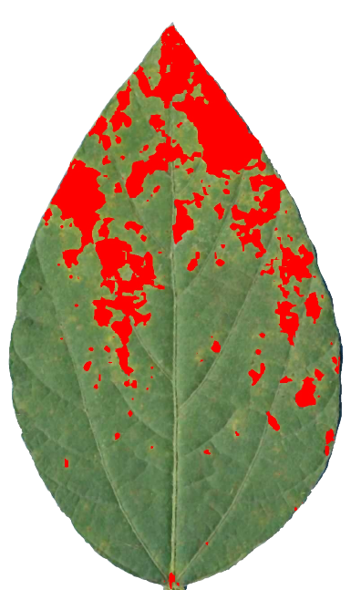
```

]


---

.lc-50[
# Contagem de objetos
```{r, out.width='75%', echo = FALSE}
img <- image_import("figs/vicia.jpg")
knitr::include_graphics('figs/vicia.jpg')

```
]


.rc-50[
```{r, out.width='75%'}
vicia <- analyze_objects(img, index = "B")
vicia$statistics
```
]


---
.lc-50[
# Área foliar
```{r, out.width='75%', echo = FALSE}
la <- image_pliman("la_leaves.jpg", plot = TRUE)

```
]


.rc-50[
```{r, out.width='80%'}
la_res <-
  analyze_objects(la,
                  watershed = FALSE, #<<
                  index = "B",
                  show_image = FALSE)

area <- get_measures(la_res, dpi = 72)
image_segment(la, "B")
plot_measures(area, "area")
```
]


---
# Forma de objetos
.lc-40[
```{r out.width="50%", eval=FALSE}
library(pliman)
potato <- image_pliman("potato_leaves.jpg")
potato_res <-
  analyze_objects(potato,
                  show_chull = TRUE,
                  watershed = FALSE)

```
]

.rc-60[
```{r out.width="100%", echo=FALSE}
library(pliman)
potato <- image_pliman("potato_leaves.jpg")
potato_res <-
  analyze_objects(potato,
                  show_chull = TRUE,
                  watershed = FALSE)

shape <- get_measures(potato_res)
plot_measures(shape, "solidity")
```

]


---
# Forma de objetos

```{r eval = FALSE}
shape <- get_measures(potato_res)
shape
```


.tiny[

$$ circularity = 4\pi(area / perimeter^2)$$

$$ solidity = area / area\_ch$$
$$ eccentricity = \sqrt{1-a^2/b^2}$$

.bg-transparent.b--blue.ba.bw2.br3.shadow-5.ph2.mt2[
A circularidade é influenciada por serrilhas e saliências nas folhas. A solidez é sensível a folhas com pecíolos distintos e pode ser usada para distinguir folhas sem tais estruturas. Ao contrário da circularidade, não é muito sensível a serrilhas e saliências menores, uma vez que o casco convexo permanece praticamente inalterado (Gupta et al, 2020).
]
]


```{r echo = FALSE}
shape <- get_measures(potato_res)
print_table(shape)
```


---
.lc-30[
# Challenges
## Lesões com pouco contraste
]

.rc-70[
```{r, out.width='80%', echo = FALSE}
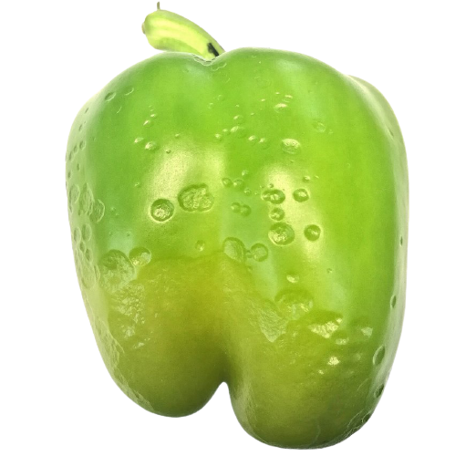
```
]


---
.lc-30[
# Challenges
## Backgrounds complexos
]

.rc-70[
```{r, out.width='90%', echo = FALSE}
knitr::include_graphics('figs/maize_1.png')
```
]


---
.lc-30[
# Challenges
## Gradientes de luminosidade
]

.rc-70[
```{r, out.width='90%', echo = FALSE}
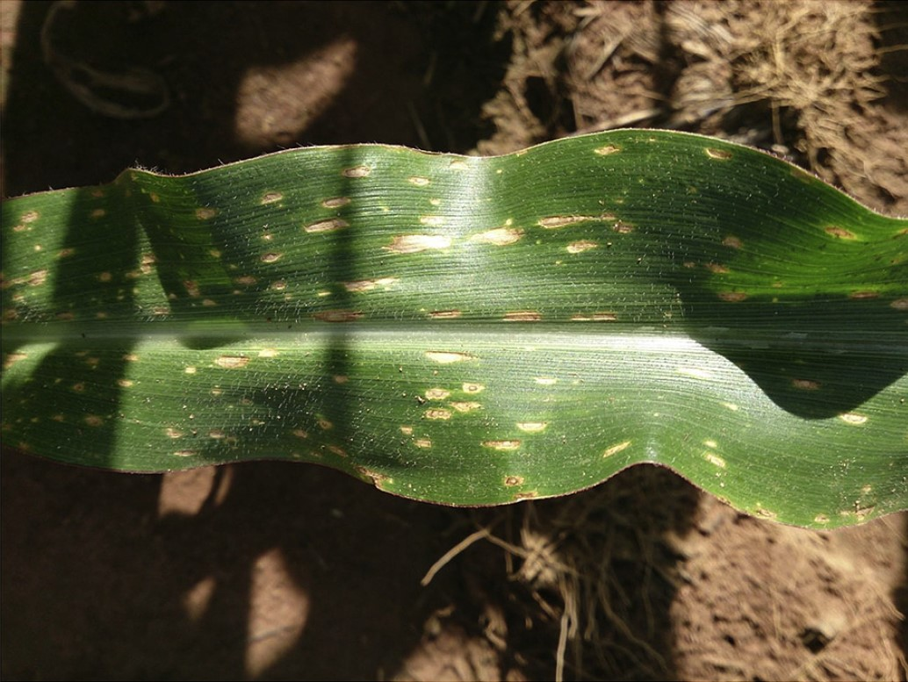
```

]


---
# Referências

.tiny[

* Gupta, S., Rosenthal, D. M., Stinchcombe, J. R., & Baucom, R. S. (2020). The remarkable morphological diversity of leaf shape in sweet potato (*Ipomoea batatas*): the influence of genetics, environment, and G×E. *New Phytologist*, 225(5), 2183–2195. doi:10.1111/NPH.16286

* Nutter, Jr., F. W. (1993). Assessing the Accuracy, Intra-rater Repeatability, and Inter-rater Reliability of Disease Assessment Systems. *Phytopathology*, 83(8), 806. doi:10.1094/PHYTO-83-806

* Olivoto, T., Andrade, S., & Del Ponte, E. M. (2021). Measuring plant disease severity in R: introducing and evaluating the pliman package. *OSF Prints*. doi:10.31219/OSF.IO/JFHM7

* Otsu, N. (1979). Threshold selection method from gray-level histograms. *IEEE Trans Syst Man Cybern*, SMC-9(1), 62–66. doi:10.1109/tsmc.1979.4310076

]


---
class: center

# Lights, camera, {pliman}!


.lc-50[

<center>
</center>

<i class="far fa-envelope"></i> [tiago.olivoto@gmail.com](mailto:tiago.olivoto@gmail.com)<br>
<i class="fas fa-home"></i> [olivoto.netlify.app](https://olivoto.netlify.app/)<br>
<i class="ai ai-lattes ai"></i>[Lattes](http://lattes.cnpq.br/2432360896340086)<br>
<i class="ai ai-google-scholar ai"></i>[Scholar](https://scholar.google.com/citations?user=QjxIJkcAAAAJ&hl=pt-BR)<br>
<i class="ai ai-researchgate ai"></i>[Research Gate](https://www.researchgate.net/profile/Tiago_Olivoto2)<br>
<i class="fab fa-twitter"></i> [@tolivoto](https://twitter.com/tolivoto)<br>
<i class="fab fa-github-square"></i> [GitHub](https://github.com/TiagoOlivoto)

]

.rc-50[


Slides criados usando os 📦 R:
.tiny[
[**xaringan**](https://github.com/yihui/xaringan)<br>
[**xaringanthemer**](https://github.com/gadenbuie/xaringanthemer)<br>
[**xaringanExtra**](https://github.com/gadenbuie/xaringanExtra)<br>
[**knitr**](http://yihui.name/knitr)<br>
[**R Markdown**](https://rmarkdown.rstudio.com) <br>
<i class="fas fa-code"></i> Código disponível no [GitHub](https://github.com/TiagoOlivoto/slides_R)
]


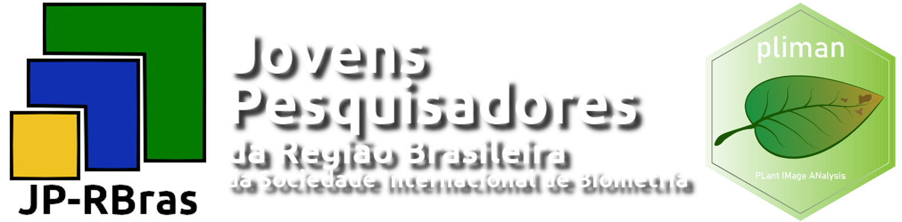

.tiny[
.bg-transparent.b--blue.ba.bw2.br3.shadow-5.ph2.mt2[
*“Se você for curioso, independentemente de gênero, raça e extrato social, então pode ser um cientista.”*
.tr[
— [Barbara McClinton](http://usp.br/cienciaweb/2019/05/barbara-mcclintock-o-milho-e-o-premio-nobel/)
]
]
]
]

---
class: center

<a href="https://olivoto.netlify.app/tutorials/pliman_omegads/"><i class="fas fa-laptop-code fa-10x"></i>

.HUGE[
**Live coding**
]


<!-- inicio academic icons -->
<link rel="stylesheet" href="https://cdn.jsdelivr.net/gh/jpswalsh/academicons@1/css/academicons.min.css">
<!-- final academic icons -->


<!-- inicio font awesome -->
<script src="https://kit.fontawesome.com/1f72d6921a.js" crossorigin="anonymous"></script>
