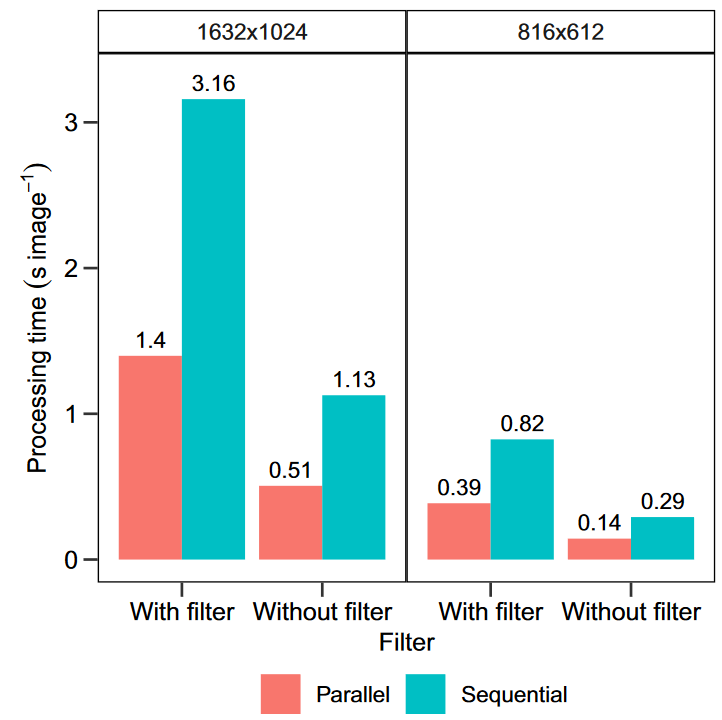

```{r, write_author_css, include = FALSE}
source("config/custom_css.R")
source("config/setup.R")
knitr::opts_chunk$set(out.width = "100%",
                      dev = "svg",
                      # cache = TRUE,
                      dev.args = list(family = "Roboto Condensed",
                                      bg = NA))

# set xaringanExtra
xaringanExtra::use_animate_css() # use animation
xaringanExtra::use_panelset() # use pannels
xaringanExtra::use_search(show_icon = TRUE) # search buttom
xaringanExtra::style_search(match_background = "blue")
xaringanExtra::use_tachyons() 
xaringanExtra::style_share_again(
  share_buttons = c("all")
)
xaringanExtra::use_broadcast()
xaringanExtra::use_scribble()

```


```{r xaringanExtra, echo = FALSE}
xaringanExtra::use_progress_bar(color = "#0051BA", location = "bottom")
```


# Motivation

.lc-70[
```{r, out.width ='55%', echo = FALSE}
knitr::include_graphics ('figs/soy_leaf.png')
```

]
.rc-30[
* How much 'injured' area in the leaflet?
* What is the area of the leaflet?
* How many leaflets do I need to analyze?
]


---

# Is there an important gap to fill?
.lc-30[
* One to three minutes per image
* Low scale in data collection
* What about data manipulation?
* What about data analysis?
* What about data presentation?
]

.rc-70[
```{r, out.width ='85%', echo = FALSE}
knitr::include_graphics('figs/quant.png')
```

]


---
# What has been done?

.lc-50[
* ImageJ (Free and open source)
* APS Assess ($295.00)
- Iterative session

* Easy Leaf Area (Python)
* Lamina (Java)
* LeafArea (R)
- What about the number and shape of the leaves?

* **Why not measuring, analyzing, and displaying the results using only one software?**
]


.rc-50[
```{r, out.width ='83%', echo = FALSE}

```

]


---

# How can we fill that gap?
## Digital images are composed of image elements (pixels)

```{r, out.width='60%', echo = FALSE, fig.cap=""}
knitr::include_graphics('figs/scheme_pixels.png')
```


---
# The RGB color space

```{r, out.width ='85%', echo = FALSE, fig.cap =""}

```


---
# Images are interpreted as arrays

.lc-50[
```{r, out.width='75%', echo = TRUE, fig.cap=""}
library(pliman)
img <- image_pliman("sev_leaf.jpg")
dim(img)
(pixels <- img@.Data[1:2, 1:2, 1:3])
```
]

.rc-50[
```{r out.width='80%'}
plot(img)
```
]


---
# Arrays can be manipulated in R!


.panelset.sideways.left[
.panel[.panel-name[Import]
```{r, out.width='65%'}
sev <- image_pliman("sev_leaf.jpg", plot = TRUE)
```

]

.panel[.panel-name[Thresholding]

.lc-50[
* Density plot (**B**)
```{r out.width ='85%'}
ind <- image_index(sev,
                   index = "B",
                   show_image = FALSE)
plot(ind, type = "density")
```

]


.rc-50[
* Raster plot (**B**)
```{r, out.width ='90%'}
plot(ind, type = "raster")
```

]
]


.panel[.panel-name[Segmentation]
.lc-50[
```{r, out.width='100%'}
image_index(sev, index = "B")
```

]
.rc-50[
```{r, out.width='100%'}
image_segment(sev, index = "B")
```
]

]

. panel[.panel-name[Indexes for segmentation]
```{r echo=FALSE}
library(DT)
# Function to make HTML tables

print_table <- function(table, rownames = FALSE, digits = 3, ...){
  datatable(table, rownames = rownames, extensions = 'Buttons',
            options = list(scrollX = TRUE,
                           pageLength = 6,
                           dom = '<<t>Bp>',
                           buttons = c('copy', 'excel', 'print')), ...)}

ind <- read.csv(file = system.file("indexes.csv",
                                   package = "pliman",
                                   mustWork = TRUE),
                header = T,
                sep = ";")
print_table(ind[,1:2])
```

]

.panel[.panel-name[Choosing an index]
```{r, out.width='100%', fig.width=20, fig.height=10}
sev |> image_horizontal() |> image_index("all")
```
]

.panel[.panel-name[Identifying the segmentation]
```{r, out.width='100%', fig.width=20, fig.height=10}
sev |> image_horizontal() |> image_segment("all")
```
]


.panel[.panel-name[Segmented Image]
.lc-33[
```{r, out.width='100%'}
image_segment(
  sev,
  index = "NB",
  threshold = 0.3
)
```

]
.lc-33[
```{r, out.width='100%'}
image_segment(
  sev,
  index = "NB",
  threshold = 0.5
)
```

]
.lc-33[
```{r, out.width='100%'}
image_segment(
  sev,
  index = "NB",
  threshold = 0.7
)
```

]


* When ` threshold ` is `NULL` (default), the Otsu's (1979) is used.

.tiny[
.bg-transparent.b--blue.ba.bw2.br3.shadow-5.ph2.mt2[
*An optimal threshold is selected by the discriminant criterion, namely, so as to maximize the separability of the resulting classes in gray levels* (Otsu, 1979)
]
]
]
]


---
# <i class =" fas fa-glasses "></i> The package pipeline


```{r, out.width='85%', echo = FALSE, fig.cap=""}
knitr::include_graphics('figs/workflow_pliman.png')
```


---

# <i class =" fa fa -book"></i> References


.lc-50[
```{r, out.width ='60%', echo = FALSE}
knitr::include_graphics('figs/paper_mee.png')
```
<i class =" fa fa -book"></i>See the article here! [here](https://besjournals.onlinelibrary.wiley.com/doi/abs/10.1111/2041-210X.13803)
]

.rc-50[
```{r, out.width ='60%', echo = FALSE}
knitr::include_graphics('figs/paper_tpp.png')
```
<i class =" fa fa -book"></i>See the article here! [here](https://link.springer.com/article/10.1007/s40858-021-00487-5)
]


---
class: center

.HUGE[
**Applications**
]


---
.lc-50[
# Leaf area
```{r, out.width ='80%', echo = FALSE}
la <- image_import("figs/leaves.jpg", plot = TRUE)

```
]

--

.rc-50[
```{r, out.width='80%'}
la_res <-
  analyze_objects(la,
                  watershed = FALSE,
                  marker = "area",
                  col_background = "blue")
area <- get_measures(la_res, dpi = 50.7)
plot_measures(area, measure = "area", size = 1.5, vjust = -30)
```
]


---
.lc-50[
# Accuracy in leaf area measurements
```{r, out.width='75%', echo = FALSE, fig.cap="Pliman vs LeafArea"}
knitr::include_graphics('figs/acuracia_area.png')

```
]

--

.rc-50[
# How quickly can we get the measurements?
```{r, out.width ='75%', echo = FALSE, fig.cap ="Processing time"}

```

]

.footnote[Source: Olivoto et al. (2022b)]


---
# Flexibility (different color backgrounds, threshold value,  etc...)

```{r, out.width='70%', echo = FALSE, fig.cap="LeafArea vs pliman."}
knitr::include_graphics('figs/area_leaf.png')

```

.footnote[Source: Olivoto et al. (2022b)]


---
.lc-50[
# Length, width, perimeter...
```{r, out.width ='85%', echo = FALSE}
fla <- image_import("figs/flax.jpg", plot = TRUE) |> image_resize(50)

```
]

--

.rc-50[
```{r, out.width='85%'}
res <-
  analyze_objects(fla,
                  reference = TRUE,
                  reference_area = 20,
                  marker = " length ")
```

]


---
# How many measurements can we obtain?

```{r echo=FALSE}
apply(res$results, 2, round, digits = 2) |> print_table()
```

.Huge[...and counting.]


<!-- --- -->
<!-- class : center -->
<!-- # More applications in this video -->

<!-- <center> -->
<!-- <iframe width="860" height="486" src="https://www.youtube.com/embed/JDqRUrTKYTI" title="YouTube video player" frameborder="0" allow="accelerometer; autoplay; clipboard- write; encrypted-media; gyroscope; picture-in-picture" allowfullscreen></iframe> -->
<!-- </center> -->


---
class : center

# Light, camera {pliman}! Analyzing plant images in R

.lc-50[

<center>
</center>

<i class="far fa-envelope"></i> [tiago.olivoto@ufsc.com](mailto:tiago.olivoto@ufsc.com)<br>
<i class="far fa-envelope"></i> [tiagoolivoto@gmail.com](mailto:tiagoolivoto@gmail.com)<br>
<i class="fas fa-home"></i> [olivoto.netlify.app](https://olivoto.netlify.app/)<br>
<i class="ai ai-lattes ai"></i>[Lattes](http://lattes.cnpq.br/2432360896340086)<br>
<i class="ai ai-google-scholar ai"></i>[Scholar](https://scholar.google.com/citations?user=QjxIJkcAAAAJ&hl=pt-BR)<br>
<i class="ai ai-researchgate ai"></i>[Research Gate](https://www.researchgate.net/profile/Tiago_Olivoto2)<br>
<i class="fab fa-twitter"></i> [@tolivoto](https://twitter.com/tolivoto)<br>
<i class="fab fa-github-square"></i> [GitHub](https://github.com/TiagoOlivoto)

]

.rc-50[

.huge[
Thanks!
]


Slides made with the 📦 R
.tiny[
[**xaringan**](https://github.com/yihui/xaringan )<br>
[**xaringanthemer**]( https://github.com/gadenbuie/xaringanthemer)<br>
[**xaringanExtra**]( https://github.com/gadenbuie/xaringanExtra)<br>
[**knitr**](http://yihui.name/ knitr)<br>
[**R Markdown **]( https://rmarkdown.rstudio.com) <br>
<i class =" fas fa-code "></i> See the code used in [GitHub](https://github.com/TiagoOlivoto/slides_R)
]<br>
[**Imagem de fundo**](https://web.archive.org/web/20161028162317/http://www.panoramio.com/photo/99521842)<br>


.tiny[
.bg-transparent.b--blue.ba.bw2.br3.shadow-5.ph2.mt2[
*“If you are curious, regardless of gender, race and social stratum, you can be a scientist.”*
.tr[
— [Barbara McClinton]( http://usp.br/cienciaweb/2019/05/barbara-mcclintock-o-milho-eo-premio-nobel/)
]
]
]
]

<!-- inicio academic icons -->
<link rel="stylesheet" href="https://cdn.jsdelivr.net/gh/jpswalsh/academicons@1/css/academicons.min.css">
<!-- final academic icons -->


<!-- inicio font awesome -->
<script src="https://kit.fontawesome.com/1f72d6921a.js" crossorigin="anonymous"></script>
