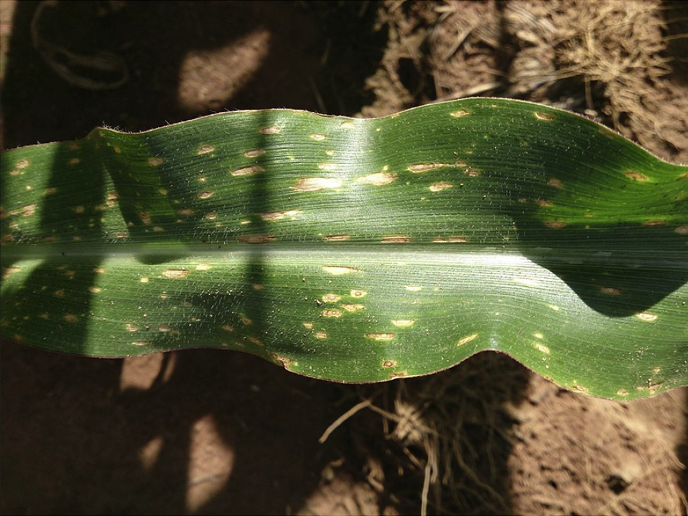

```{r, write_author_css, include = FALSE}
source("config/custom_css.R")
source("config/setup.R")
knitr::opts_chunk$set(out.width = "100%",
                      dev = "svg",
                      dev.args = list(family = "Roboto Condensed",
                                      bg = NA))

# set xaringanExtra
xaringanExtra::use_animate_css() # use animation
xaringanExtra::use_panelset() # use pannels
xaringanExtra::use_search(show_icon = TRUE) # search buttom
xaringanExtra::style_search(match_background = "blue")
xaringanExtra::use_tachyons() 
xaringanExtra::style_share_again(
  share_buttons = c("all")
)
xaringanExtra::use_broadcast()
xaringanExtra::use_scribble()


library(DT)
# Function to make HTML tables

print_table <- function(table, rownames = FALSE, digits = 3, ...){
  datatable(table, rownames = rownames, extensions = 'Buttons',
            options = list(scrollX = TRUE,
                           pageLength = 6,
                           dom = '<<t>Bp>',
                           buttons = c('copy', 'excel', 'print')), ...)}

```


```{r xaringanExtra, echo = FALSE}
xaringanExtra::use_progress_bar(color = "#0051BA", location = "bottom")
```


```{r echo = FALSE}
knitr::include_graphics ('figs/logos.png')
```

---
.Huge[Acesso aos materiais]
```{r echo = FALSE, out.width='100%'}

```


---
# Motivação

.lc-70[
```{r, out.width ='55%', echo = FALSE}
knitr::include_graphics ('figs/soy_leaf.png')
```

]
.rc-30[
* Qual é a área "lesionada" do folíolo?
* Qual é a área do folíolo?
* Quantas folíolos eu preciso analisar?
]


---

# Existe uma lacuna importante a ser preenchida?
.lc-30[
* De um a três minutos por imagem
* Escala baixa na coleta de dados
* E quanto à manipulação de dados?
* E quanto à análise de dados?
* E quanto à apresentação de dados?
]

.rc-70[
```{r, out.width ='85%', echo = FALSE}
knitr::include_graphics('figs/quant.png')
```

]


---
# O que tem sido feito?

.lc-50[
* ImageJ (Gratuito e de código aberto)
* APS Assess ($295.00)
- Iterative session

* Easy Leaf Area (Python)
* Lamina (Java)
* LeafArea (R)
- E quanto ao número e formato das folhas?

* **Por que não mensurar, analisar e exibir os resultados usando apenas um software?**
]


.rc-50[
```{r, out.width ='83%', echo = FALSE}
knitr::include_graphics('figs/softwares.png')
```

]


---

# Como preencher essa lacuna?
## As imagens digitais são compostas por elementos de imagem (pixels)

```{r, echo = FALSE, fig.cap=""}
knitr::include_graphics('figs/scheme_pixels.png')
```


## Cada pixel é o resultado da adição de cores R (red) G (green) e B (blue)
### Intensidade de cada banda define a cor

---
# O espaço de cores RGB

```{r, echo = FALSE, fig.cap ="", out.height='100%'}

```


---
# Imagens são interpretadas como arrays

.lc-50[
```{r, out.width='75%', echo = TRUE, fig.cap=""}
library(pliman)
img <- image_import("figs/seg.jpg")
dim(img)
(pixels <- img@.Data[1:2, 1:2, 1:3])
```
]

.rc-50[

```{r out.width='85%', out.height='85%', echo=FALSE}
plot(img)
```
]


---
# Arrays podem ser manipulados no R!


.panelset.sideways.left[
.panel[.panel-name[Importar]
```{r, out.width='65%'}
flax <- image_import("figs/seg.jpg", plot = TRUE)
```

]

.panel[.panel-name[Thresholding]

.lc-50[
* Densidade (**B**)
```{r out.width ='85%'}
ind <- image_index(flax,
                   index = "B",
                   plot = FALSE)
plot(ind, type = "density")
```

]


.rc-50[
* Raster (**B**)
```{r}
plot(ind, type = "raster")
```

]
]


.panel[.panel-name[Segmentação]
.lc-50[
```{r, out.width='100%'}
image_index(flax, index = "B")
```

]
.rc-50[
```{r, out.width='100%'}
image_segment(flax, index = "B")
```
]

]

. panel[.panel-name[Índices para segmentação]
```{r echo=FALSE}
ind <- read.csv(file = system.file("indexes.csv",
                                   package = "pliman",
                                   mustWork = TRUE),
                header = T,
                sep = ";")
print_table(ind[,1:2])
```

]

.panel[.panel-name[Imagem segmentada]
.lc-33[
```{r, out.width='100%'}
image_segment(
  flax,
  index = "B",
  threshold = 0.2
)
```

]
.lc-33[
```{r, out.width='100%'}
image_segment(
  flax,
  index = "B")
```
]

.lc-33[
```{r, out.width='100%'}
image_segment(
  flax,
  index = "B",
  threshold = 0.75
)
```
]


* Quando `threshold` é `NULL` (padrão), o método de Otsu (1979) é usado.

.tiny[
.bg-transparent.b--blue.ba.bw2.br3.shadow-5.ph2.mt2[
*An optimal threshold is selected by the discriminant criterion, namely, so as to maximize the separability of the resulting classes in gray levels* (Otsu, 1979)
]
]
]
]


---
# <i class =" fas fa-glasses "></i> O pipeline do pacote


```{r, out.width='85%', echo = FALSE, fig.cap=""}
knitr::include_graphics('figs/workflow_pliman.png')
```


---
# <i class =" fa fa -book"></i> Referências


.lc-50[
```{r, out.width ='60%', echo = FALSE}
knitr::include_graphics('figs/paper_mee.png')
```
<i class =" fa fa -book"></i>Veja o artigo [aqui](https://besjournals.onlinelibrary.wiley.com/doi/abs/10.1111/2041-210X.13803)
]

.rc-50[
```{r, out.width ='60%', echo = FALSE}
knitr::include_graphics('figs/paper_tpp.png')
```
<i class =" fa fa -book"></i>Veja o artigo [aqui](https://link.springer.com/article/10.1007/s40858-021-00487-5)
]


---
.lc-50[
# Acurácia na mensuração de área foliar
```{r, out.width='75%', echo = FALSE, fig.cap="Pliman vs LeafArea"}
knitr::include_graphics('figs/acuracia_area.png')

```
.footnote[Fonte: Olivoto et al. (2022b)]
]


--

.rc-50[
# Quão rápidos podemos obter as medidas?
```{r, out.width ='75%', echo = FALSE, fig.cap ="Tempo de processamento"}
knitr::include_graphics('figs/time.png')
```

]


---
# Quantas medidas podemos obter?

.lc-30[
```{r message=FALSE, warning=FALSE}
fla <- image_import("figs/flax.jpg")
res <-
  analyze_objects(fla,
                  reference = TRUE,
                  reference_area = 20,
                  efourier = TRUE,
                  haralick = TRUE,
                  ab_angles = TRUE,
                  marker = "id")
```

]

.rc-70[
```{r echo=FALSE, message=FALSE, warning=FALSE}
fla <- image_import("figs/flax.jpg")
res <-
  analyze_objects(fla,
                  reference = TRUE,
                  reference_area = 20,
                  efourier = TRUE,
                  haralick = TRUE,
                  ab_angles = TRUE,
                  plot = FALSE)
medidas <- get_measures(res)
apply(medidas, 2, round, digits = 2) |> print_table()
```

]

.Huge[...e contando.]


---
.lc-30[
# Challenges
## Lesões com pouco contraste
]

.rc-70[
```{r, out.width='80%', echo = FALSE}
knitr::include_graphics('figs/challenge.png')
```
]


---
.lc-30[
# Challenges
## Backgrounds complexos
]

.rc-70[
```{r, out.width='90%', echo = FALSE}

```
]


---
.lc-30[
# Challenges
## Gradientes de luminosidade
]

.rc-70[
```{r, out.width='90%', echo = FALSE}

```

]


---
class: center

.Huge[Agradecimentos]

```{r echo = FALSE, out.width='95%'}

```


---
class: center

# Luz câmera {pliman}! analisando imagens de plantas no R

.lc-50[

<center>
</center>

<i class="far fa-envelope"></i> [tiago.olivoto@ufsc.com](mailto:tiago.olivoto@ufsc.com)<br>
<i class="fas fa-home"></i> [olivoto.netlify.app](https://olivoto.netlify.app/)<br>
<i class="ai ai-lattes ai"></i>[Lattes](http://lattes.cnpq.br/2432360896340086)<br>
<i class="ai ai-google-scholar ai"></i>[Scholar](https://scholar.google.com/citations?user=QjxIJkcAAAAJ&hl=pt-BR)<br>
<i class="ai ai-researchgate ai"></i>[Research Gate](https://www.researchgate.net/profile/Tiago_Olivoto2)<br>
<i class="fab fa-twitter"></i> [@tolivoto](https://twitter.com/tolivoto)<br>
<i class="fab fa-github-square"></i> [GitHub](https://github.com/TiagoOlivoto)

]

.rc-50[

.huge[
Obrigado!
]


Slides produzidos com os 📦 R
.tiny[
[**xaringan**](https://github.com/yihui/xaringan )<br>
[**xaringanExtra**]( https://github.com/gadenbuie/xaringanExtra)<br>
<i class =" fas fa-code "></i> Veja o código no [GitHub](https://github.com/TiagoOlivoto/slides_R)<br>

```{r echo = FALSE, out.width='100%'}

```


]

<!-- inicio academic icons -->
<link rel="stylesheet" href="https://cdn.jsdelivr.net/gh/jpswalsh/academicons@1/css/academicons.min.css">
<!-- final academic icons -->


<!-- inicio font awesome -->
<script src="https://kit.fontawesome.com/1f72d6921a.js" crossorigin="anonymous"></script>
