```{r, write_author_css, include = FALSE}
source("config/custom_css.R")
source("config/setup.R")
knitr::opts_chunk$set(out.width = "100%",
                      dev = "svg",
                      # cache = TRUE,
                      dev.args = list(family = "Roboto Condensed",
                                      bg = NA))

# set xaringanExtra
xaringanExtra::use_animate_css() # use animation
xaringanExtra::use_panelset() # use pannels
xaringanExtra::use_search(show_icon = TRUE) # search buttom
xaringanExtra::style_search(match_background = "blue")
xaringanExtra::use_tachyons() 
xaringanExtra::style_share_again(
  share_buttons = c("all")
)
xaringanExtra::use_broadcast()
xaringanExtra::use_scribble()
```


# Tópicos da apresentação

•	Apresentação pessoal   
•	Formação Acadêmica   
•	Atividades de Ensino   
•	Atividades de Pesquisa   
•	Atividades de Extensão   
•	Projetos e Perspectivas Futuras na UFSC   


---
# Onde tudo começou...

* **Nascimento**: 14/07/1990
* **Filiação**: Luiz Antônio Olivoto e Sidnei Salette Carniel Olivoto
* **Naturalidade**: Cacique Doble, RS

```{r, out.width='100%', echo = FALSE}
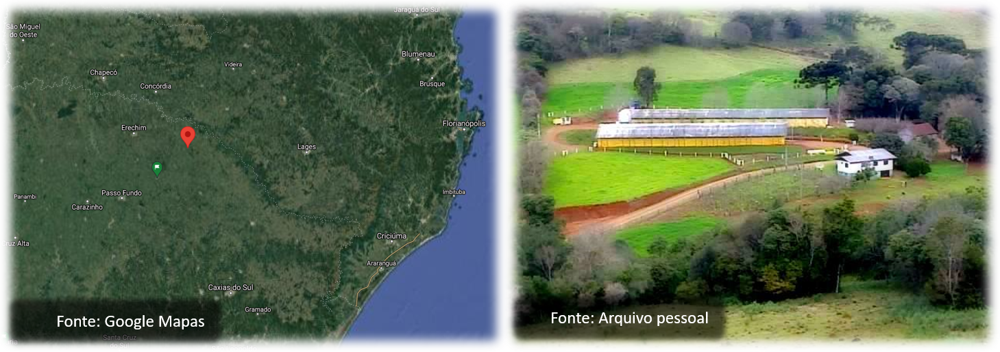
```


---
# Formação básica

```{r, out.width='93%', echo = FALSE}
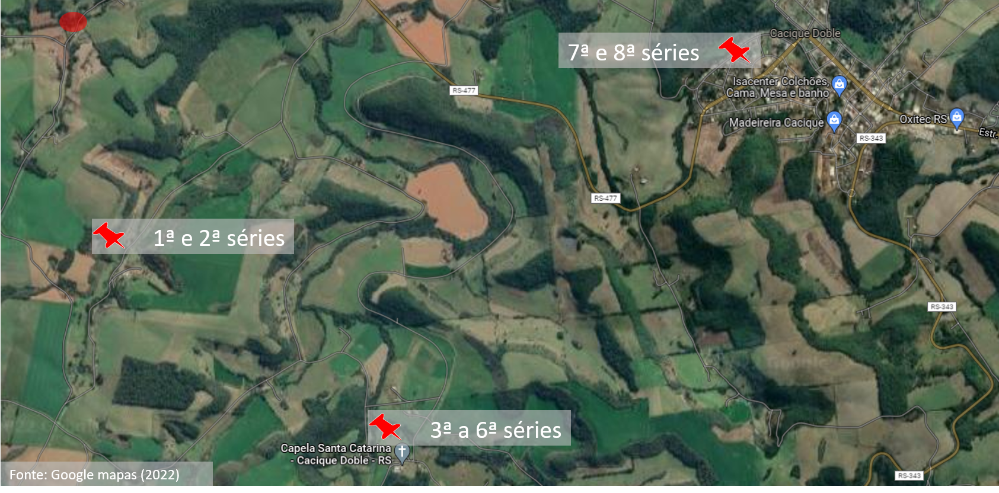
```


---
# Linha do tempo Profissional e Acadêmica

```{r, out.width='110%', echo = FALSE}
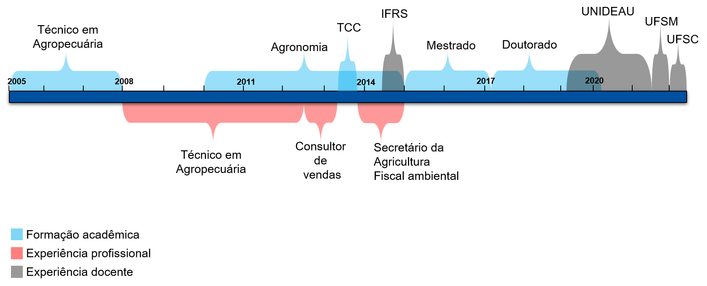
```


---
# Técnico em Agropecuária – 2005 a 2007

```{r, out.width='85%', echo = FALSE}
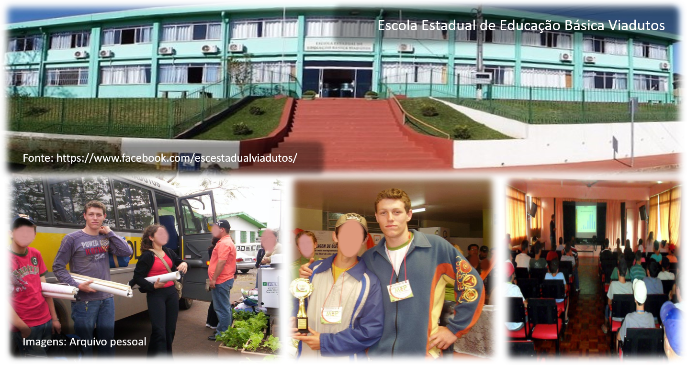
```


---
# Graduação em Agronomia – 2010 a 2014

```{r, out.width='80%', echo = FALSE}
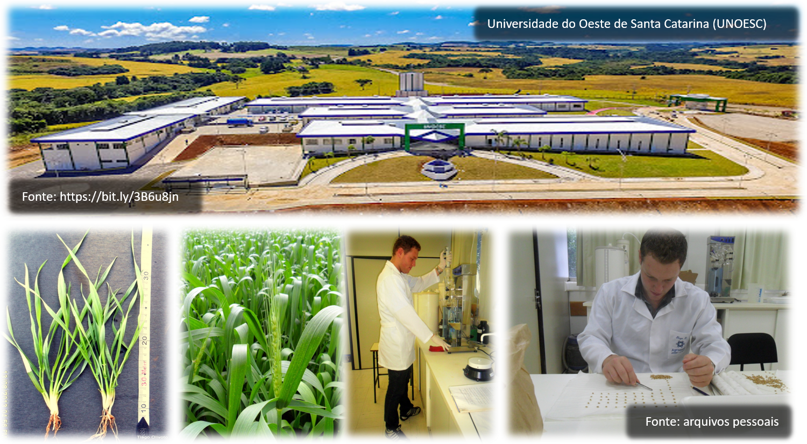
```


---
# Graduação em Agronomia – 2010 a 2014
## Em 2010...

```{r, out.width='100%', echo = FALSE}
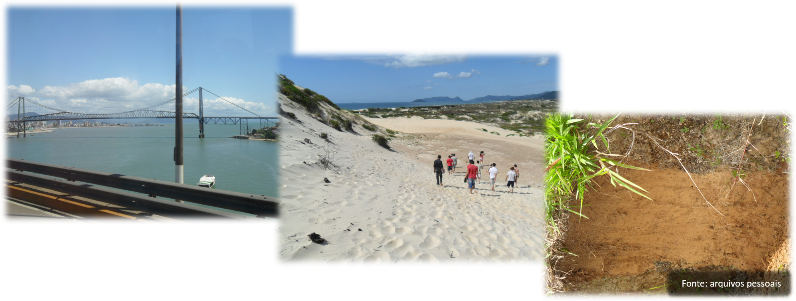
```


---
# Enquanto cursava Agronomia...

```{r, out.width='100%', echo = FALSE}
knitr::include_graphics('figs/trabalho.png')
```


---
# Atividades de ensino

* Horas aula: ~**1970** horas
* Alunos: ~**980** alunos
* Disciplinas: **23** disciplinas
* Orientações de TCC: **12**
* Bancas de trabalho de conclusão: **54**

```{r, out.width='90%', echo = FALSE}
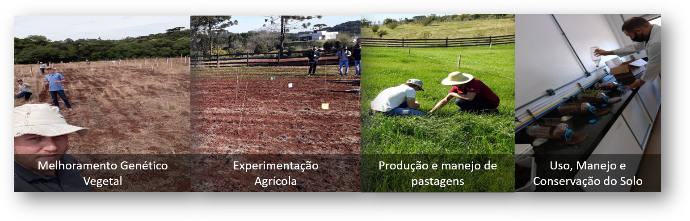
```


---
# Atividades de Pesquisa


```{r, out.width='100%', echo = FALSE}
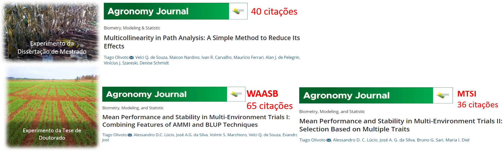
```

 <i class="far fa-file-pdf"></i>Leia a dissertação [aqui](https://www.researchgate.net/publication/326812788_Bias_due_to_the_data_arrangement_and_sample_size_and_its_implications_on_the_accuracy_of_indirect_selection_in_plant_breeding_Vies_associado_ao_arranjo_de_dados_e_tamanho_amostral_e_suas_implicacoes_n).   

<i class="far fa-file-pdf"></i>Leia a tese [aqui](https://www.researchgate.net/publication/339271444_Indices_de_Estabilidade_Genotipica_e_Selecao_Simultanea_Multivariada_Uma_Nova_Abordagem).


---
# Atividades de Pesquisa

```{r, out.width='100%', echo = FALSE}
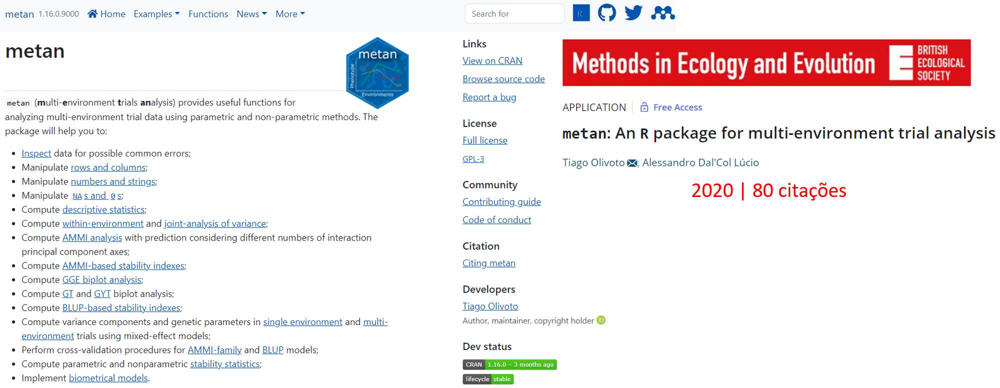
```

<i class="fa fa-link"></i>[Site do pacote](https://tiagoolivoto.github.io/metan/) | <i class="fa fa-link"></i>[Publicação](https://www.researchgate.net/publication/339714328_metan_An_R_package_for_multi-environment_trial_analysis)


---
# Atividades de Pesquisa

```{r, out.width='76%', echo = FALSE}
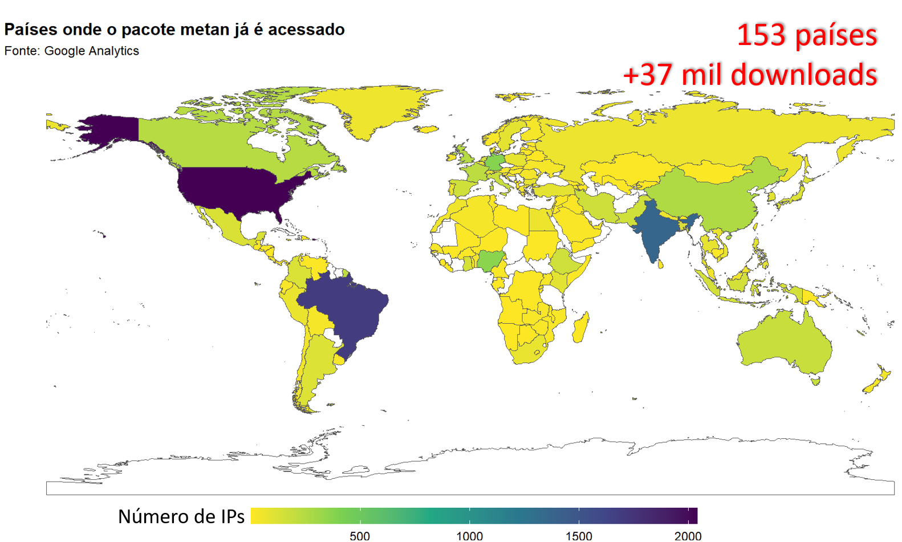
```


---
# Atividades de Pesquisa

```{r, out.width='85%', echo = FALSE}
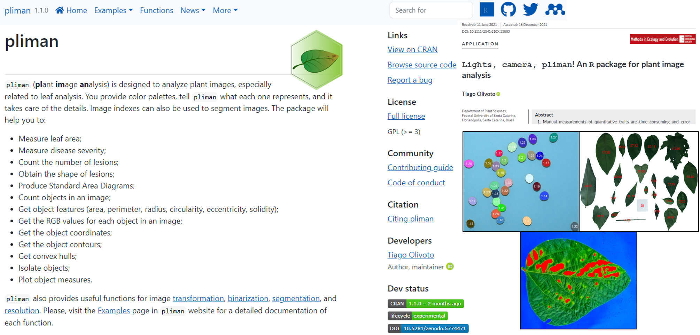
```

<i class="fa fa-link"></i>[Site do pacote](https://tiagoolivoto.github.io/pliman/) | <i class="fa fa-link"></i>[Publicação](https://www.researchgate.net/publication/357909074_Lights_camera_pliman_An_R_package_for_plant_image_analysis)


---
# Atividades de Extensão

```{r, out.width='90%', echo = FALSE}
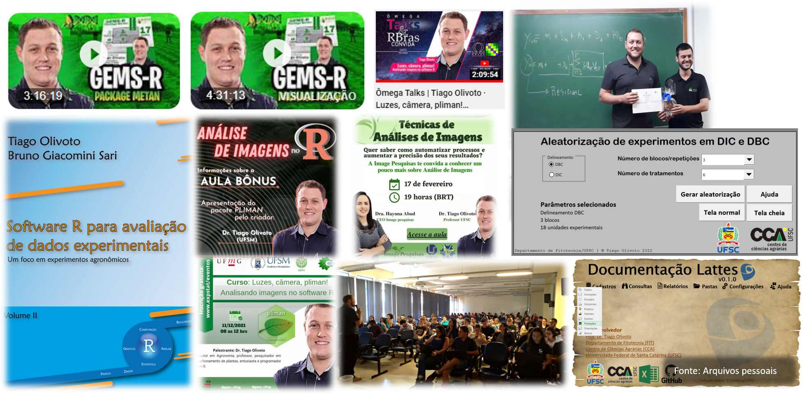
```


---
# Projetos e Perspectivas Futuras na UFSC

.lc-50[
## Ensino
* Oferta de disciplinas 
* Criação de disciplinas 
* Credenciamento na Pós-Graduação


## Pesquisa
* Melhoramento, desempenho agronômico e manejo de espécies funcionais   
* Desenvolvimento e aperfeiçoamento de índices multivariados de seleção   
* Melhoria dos pacotes pliman e metan
* Implementação de versões "web" dos pacotes
* Colaborações Nacionais e Internacionais   


]

.rc-50[
```{r, out.width='100%', echo = FALSE}
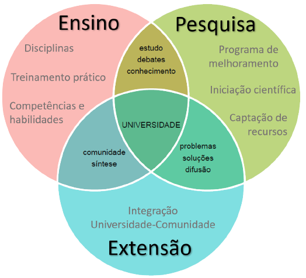
```

]


---
# Projetos e Perspectivas Futuras na UFSC

.lc-50[

## Extensão
* Software R nas Ciências Agrárias
   - Cursos de capacitação
   - Lives
   - Materiais didáticos
   - **Pesquisa reproduzível**
* Integrar a Universidade à Comunidade
   - Demandas da comunidade
   - Melhoramento Participativo
   - Forte presença nas Mídias Sociais
   
## Atividades administrativas
* Comissões
* Cargos Administrativos

]

.rc-50[
```{r, out.width='100%', echo = FALSE}

```

]


---
class: center

# \#orgulhodeserufsc \#orgulhodesercca


.lc-50[

<center>
</center>

<i class="far fa-envelope"></i> [tiago.olivoto@ufsc.com](mailto:tiago.olivoto@ufsc.com)<br>
<i class="far fa-envelope"></i> [tiagoolivoto@gmail.com](mailto:tiagoolivoto@gmail.com)<br>
<i class="fas fa-home"></i> [olivoto.netlify.app](https://olivoto.netlify.app/)<br>
<i class="ai ai-lattes ai"></i>[Lattes](http://lattes.cnpq.br/2432360896340086)<br>
<i class="ai ai-google-scholar ai"></i>[Scholar](https://scholar.google.com/citations?user=QjxIJkcAAAAJ&hl=pt-BR)<br>
<i class="ai ai-researchgate ai"></i>[Research Gate](https://www.researchgate.net/profile/Tiago_Olivoto2)<br>
<i class="fab fa-twitter"></i> [@tolivoto](https://twitter.com/tolivoto)<br>
<i class="fab fa-github-square"></i> [GitHub](https://github.com/TiagoOlivoto)

]

.rc-50[


Slides criados usando os 📦 R:
.tiny[
[**xaringan**](https://github.com/yihui/xaringan)<br>
[**xaringanthemer**](https://github.com/gadenbuie/xaringanthemer)<br>
[**xaringanExtra**](https://github.com/gadenbuie/xaringanExtra)<br>
[**knitr**](http://yihui.name/knitr)<br>
[**R Markdown**](https://rmarkdown.rstudio.com) <br>
<i class="fas fa-code"></i> Código disponível no [GitHub](https://github.com/TiagoOlivoto/slides_R)
]


.tiny[
.bg-transparent.b--blue.ba.bw2.br3.shadow-5.ph2.mt2[
*“Na busca de um sonho, não atropele etapas. Trilhe o caminho das conquistas com marcos resistentes ao tempo para que outras pessoas também possam segui-lo e para que, principalmente, nunca esqueças de onde vieste.”*
.tr[
— Tiago Olivoto
]
]
]
]


<!-- inicio academic icons -->
<link rel="stylesheet" href="https://cdn.jsdelivr.net/gh/jpswalsh/academicons@1/css/academicons.min.css">
<!-- final academic icons -->


<!-- inicio font awesome -->
<script src="https://kit.fontawesome.com/1f72d6921a.js" crossorigin="anonymous"></script>
