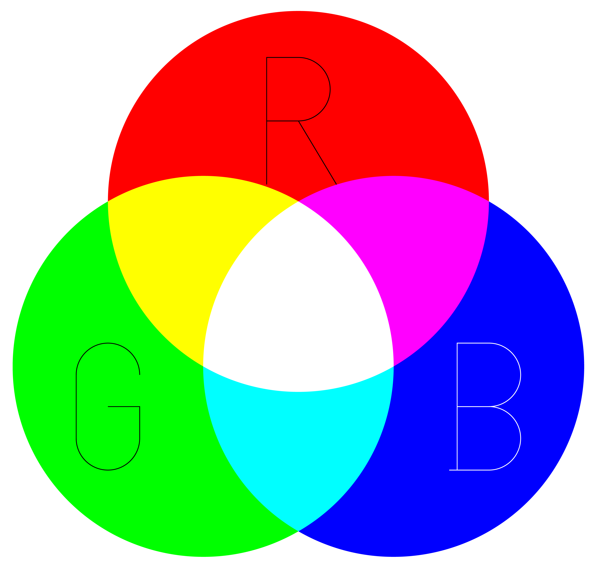
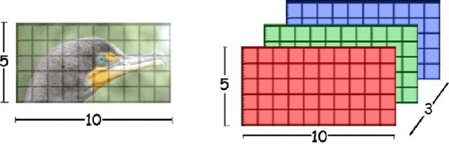
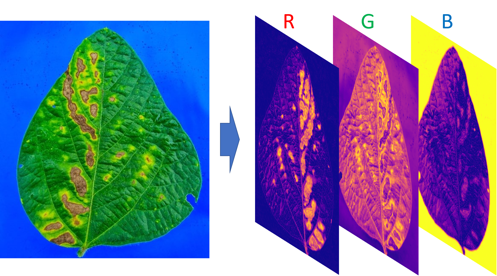
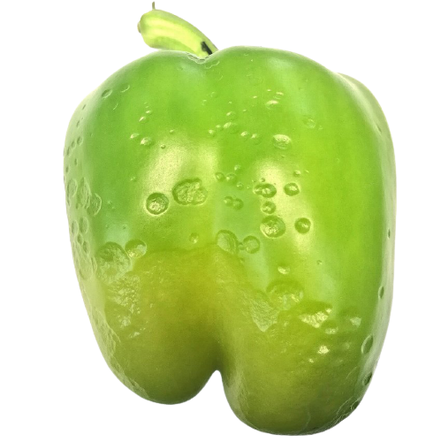

```{r, write_author_css, include = FALSE}
source("config/custom_css.R")
source("config/setup.R")
knitr::opts_chunk$set(out.width = "100%",
                      dev = "svg",
                      # cache = TRUE,
                      dev.args = list(family = "Roboto Condensed",
                                      bg = NA))

# set xaringanExtra
xaringanExtra::use_animate_css() # use animation
xaringanExtra::use_panelset() # use pannels
xaringanExtra::use_search(show_icon = TRUE) # search buttom
xaringanExtra::style_search(match_background = "blue")
xaringanExtra::use_tachyons() 
xaringanExtra::style_share_again(
  share_buttons = c("all")
)
xaringanExtra::use_broadcast()
xaringanExtra::use_scribble()
```


# Doenças de plantas

.lc-50[
* Respostas visíveis e invisíveis
* Mudanças adversas na forma, função ou integridade da planta
* Pode ou não levar a morte a planta toda ou parte dela

.tiny[
.bg-transparent.b--blue.ba.bw2.br3.shadow-5.ph4.mt5[
Any malfunctioning of host cells and tissues that results from continuous irritation by a pathogenic agent or environmental factor and leads to development of symptoms

.tr[
— Agrios (2005)
]]
]
]

--

.rc-50[
```{r, out.width='75%', echo = FALSE}

```

]


---
# Curva do progresso da doença


.panelset.sideways.left[
.panel[.panel-name[O desafio]

## Biótico ou abiótico?

```{r, out.width='70%', echo = FALSE}

```

]

.panel[.panel-name[A evolução dos sintomas]

## Curva teórica do desenvolvimento da doença

```{r, fig.height=4, fig.width=6, out.width="150%", echo = FALSE, echo=FALSE, fig.cap="Curva teórica do desenvolvimento de uma doença"}
library(epifitter)
library(tidyverse)
logi_low <- 
  sim_logistic(
    N = 100,    # total time units 
    y0 = 0.01,  # initial inoculum
    dt = 10,    #  interval between assessments in time units
    r = 0.09,  #  apparent infection rate
    alpha = 0.2,# level of noise
    n = 4       # number of replicates
  )
ggplot(logi_low, aes(time, y)) +
  # geom_jitter(aes(time, random_y), size = 3, width = .1) +
  geom_line(size = 1) +
  labs( y = "Severidade da doença",
        x = "Tempo" )+
  theme_gray(base_size = 24) +
  theme_minimal() + 
  theme(panel.background = element_rect(fill = NA),
        axis.text = element_blank(),
        panel.grid = element_blank())
```

]

.panel[.panel-name[Simulação]
## Simulação de curvas de doenças
```{r image-pliman}
library(tidyverse)
library(epifitter)
logi_low <- 
  sim_logistic(
    N = 100,    # total time units 
    y0 = 0.01,  # initial inoculum
    dt = 10,    #  interval between assessments in time units
    r = 0.09,  #  apparent infection rate
    alpha = 0.2,# level of noise
    n = 4       # number of replicates
  ) %>% 
  mutate(model = "Baixa taxa de infecção")

logi_high <- 
  sim_logistic(
    N = 100,    # total time units 
    y0 = 0.01,  # initial inoculum
    dt = 10,    #  interval between assessments in time units
    r = 0.18,  #  apparent infection rate
    alpha = 0.2,# level of noise
    n = 4       # number of replicates
  ) %>% 
  mutate(model = "Alta taxa de infecção")

df_bind <- rbind(logi_low, logi_high)

```

Curvas simuladas utilizando o pacote `epifitter` (Alves, 2021)
]

.panel[.panel-name[Curvas simuladas]
## Curvas simuladas


```{r image-plot, fig.height=10, fig.width=15, out.width="90%", echo=FALSE}
ggplot(df_bind, aes(time, y)) +
  geom_jitter(aes(time, random_y, color = model), size = 3, width = .1) +
  geom_line(aes(color = model), size = 1) +
  labs( y = "Severidade da doença",
        x = "Tempo" )+
  theme_gray(base_size = 24) +
  theme(legend.position = "bottom",
        legend.title = element_blank())


```

]

.panel[.panel-name[E no campo?]
## Resultados de campo
```{r, out.width='90%', echo = FALSE, fig.cap = "Evolução da ferrugem da aveia em diferentes anos com e sem fungicida (dados pessoais)."}

```

]
]


---

# Fitopatometria

- *Fito* (planta) + *pato* (doença) + *metria* (medição/quantificação)   
> Quantificação de doenças de plantas 


## Objetivos
- Predizer danos e perdas de rendimento;
- Comparar a eficiência de fungicidas;
- Determinar a época de aplicação de fungicidas;
- Verificar o efeito de estratégias de controle;
- Avaliar a resistência de genótipos aos patógenos no melhoramento
- Estudar o progresso da doença
- Elaborar modelos de previsão de doenças


---
## Incidência
* Contagem de plantas ou órgãos doentes
* Não levam em consideração a **quantidade** de doença

.lc-50[
**Vantagens**
* Fácil
* Rápido
* Menor subjetividade
]

.rc-50[
**Desvantagens**
* Baixa precisão para doenças foliares
]


---
## Severidade

* Método predominantemente quantitativo
* Determinar a porcentagem da área de tecido com sintomas
- Medição direta
- chaves descritivas
- Escalas diagramáticas
- Mensuração automática utilizando softwares


---
## Estimação
```{r, out.width='80%', echo = FALSE, fig.cap="Os estágios na estimativa da severidade da doença das plantas por avaliadores visuais e por análise de imagem por meio de um sensor (Bock et al. 2021)"}

```


---
## Standard area diagrams

```{r, out.width='65%', echo = FALSE}

```


.bg-transparent.b--blue.ba.bw2.br3.shadow-5.ph2.mt2[
*A set of illustrations depicting incremental percent severity values* (Nutter, 1993)
]


---

## Desafio

### Qual a *severidade* estimada na imagem abaixo?

.lc-30[
```{r, out.width='80%', echo = FALSE}
knitr::include_graphics('figs/soybean_rust.png')
```

]

--

.rc-70[
```{r, out.width='100%', echo = FALSE, fig.cap="Diagramas de área padrão para ferrugem da soja (Franceschi et al. 2020)"}

```


]

---

## Algumas fontes de erro

```{r, out.width='80%', echo = FALSE, fig.cap="Potenciais fontes de erro que afetam a precisão do avaliador durante o processo de avaliação e abordagens e ferramentas para aumentar a precisão (Bock et al. 2021)"}

```


---
# Quantificação via software

## Como uma imagem é interpretada

```{r, out.width='70%', echo = FALSE, fig.cap=""}
knitr::include_graphics('figs/scheme_pixels.png')
```

---
## Como uma imagem é interpretada

.lc-50[
```{r, out.width='80%', echo = TRUE, fig.cap=""}
library(pliman)
img <- image_import(image_pliman("sev_leaf.jpg"))
dim(img)
pixels <- img@.Data[1:3, 1:3, ]
pixels
```
]

.rc-50[
```{r out.width='120%'}
plot(img)
```

]


---
## O espaço de cores RGB
```{r, out.width='50%', echo = FALSE, fig.cap=""}

```

Fonte: https://bit.ly/3AKlIOQ


---
## O espaço de cores RGB

**R**ed | **G**reen | **B**lue


```{r, out.width='90%', echo = FALSE, fig.cap=""}

```

Fonte: https://bit.ly/3ufaBec


---
## O espaço de cores RGB

```{r, out.width='95%', echo = FALSE, fig.cap=""}

```


---
# Estratégias para quantificação via software
## Modelos preditivos

```{r, out.width='65%', echo = FALSE, fig.cap="Etapas principais do processo de quantificação da severidade utilizando o pacote pliman baseado em um modelo preditivo (Olivoto et al. 2021)"}
knitr::include_graphics('figs/workflow.png')
```

---
## Thresholding (limiar)


.panelset.sideways.left[
.panel[.panel-name[Aquisição da imagem]
```{r, out.width='75%'}
plot(img)
```

]

.panel[.panel-name[Thresholding]

.lc-50[
* Histograma dos valores de **B**
```{r out.width='90%'}
B_mat <- img@.Data[,,3]
B_df <- data.frame(B = as.numeric(B_mat))
ggplot(B_df, aes(x = B)) +
  geom_density(fill = "red", alpha = 0.6) + 
  theme_gray(base_size = 22)

```

]


.rc-50[
* Gráfico *Raster*
```{r, out.width='90%', echo = FALSE}
B_band <- data.frame(img@.Data[,,3])
colnames(B_band) <- 1:ncol(B_band)
B_band$id <- 1:nrow(B_band)
B_band <-
  reshape(B_band,
          direction = "long",
          varying = list(names(B_band)[1:ncol(B_band)-1]),
          v.names = "value",
          idvar = "id",
          timevar = "y",
          times = names(B_band)[1:ncol(B_band)-1])
B_band$y <- as.numeric(B_band$y)

ggplot(B_band, aes(id, y)) +
  geom_raster(aes(fill = value)) +
  scale_x_continuous(expand = expansion(mult = 0), labels = NULL, breaks = NULL)+
  scale_y_continuous(expand = expansion(mult = 0), labels = NULL, breaks = NULL) +
  labs(x = NULL, y = NULL) +
  scale_fill_gradient(low = "blue", high = "red") +
  theme_gray(base_size = 22) +
  theme(axis.ticks.length = unit(0.2, "cm"),
        axis.text = element_blank()) +
  guides(fill = guide_colourbar(label = TRUE,
                                draw.ulim = TRUE,
                                draw.llim = TRUE,
                                frame.colour = "black",
                                ticks = TRUE,
                                ticks.colour = "black",
                                title = NULL,
                                label.position = "right",
                                barwidth = 1.3,
                                barheight = 20,
                                direction = 'vertical'))
```

]
]


.panel[.panel-name[Segmentação]
.lc-50[
```{r, out.width='100%'}
image_index(img, index = "B")
```

]
.rc-50[
```{r, out.width='100%'}
image_segment(img,
              index = "B",
              threshold = 0.5,
              invert = TRUE)
```
Almost there🙄
]

]

.panel[.panel-name[Índices para segmentação]
```{r echo=FALSE}
library(DT)
# Function to make HTML tables

print_table <- function(table, rownames = FALSE, ...){
  datatable(table, rownames = rownames, extensions = 'Buttons',
            options = list(scrollX = TRUE, 
                           dom = '<<T>Bp>',
                           buttons = c('copy', 'excel')), ...)
}
ind <- read.csv(file = system.file("indexes.csv", 
                                   package = "pliman",
                                   mustWork = TRUE),
                header = T, 
                sep = ";")
print_table(ind)
```

]


.panel[.panel-name[Escolha do índice]
```{r, out.width='85%', fig.width=20, fig.height=18}
image_segment(img, index = "all", ncol = 6)
```

]


.panel[.panel-name[Segmentação pelo índice]

.lc-50[
```{r, out.width='100%'}
indexes <- 
  image_index(img,
              index = "NB",
              show_image = FALSE)
plot(indexes) + 
  theme_gray(base_size = 22)
```

]

.rc-50[
```{r, out.width='100%'}
plot(indexes, type = "hist")  +
  theme_gray(base_size = 22)
```

]

]

.panel[.panel-name[Imagem segmentada]

.lc-33[
```{r, out.width='100%'}
image_segment(
  img,
  index = "NB",
  threshold = 0.3
)
```

]
.lc-33[
```{r, out.width='100%'}
image_segment(
  img,
  index = "NB",
  threshold = 0.5
)
```

]
.lc-33[
```{r, out.width='100%'}
image_segment(
  img,
  index = "NB",
  threshold = 0.7
)
```

]

--
* Quando `threshold` é igual a `NULL` (padrão), o método de Otsu (1979) é aplicado.

.tiny[
.bg-transparent.b--blue.ba.bw2.br3.shadow-5.ph2.mt2[
*An optimal threshold is selected by the discriminant criterion, namely, so as to maximize the separability of the resultant classes in gray levels* (Outsu, 1979)
]
]

]

]

---

## Aplicação

```{r fig.width=20, out.width='100%'}
image_segment_iter(img,
                   nseg = 2,
                   index = c("NB", "GLI"),
                   ncol = 3)
```


---
# Softwares para quantificação de doenças

.lc-30[
* [APS Assess](https://my.apsnet.org/APSStore/Product-Detail.aspx?WebsiteKey=2661527A-8D44-496C-A730-8CFEB6239BE7&iProductCode=43696)
* [ImageJ](https://imagej.net/software/imagej/)
* [LeafDoctor](https://apsjournals.apsnet.org/doi/10.1094/PDIS-03-15-0319-RE)
* [Quant](https://www.locus.ufv.br/handle/123456789/10126)
* [pliman](https://tiagoolivoto.github.io/pliman/)
]

.rc-70[
```{r echo = FALSE, fig.cap="Adaptado de Olivoto et al. (2021)"}

```


]


---
# Procedimentos

.lc-30[
* Aquisição (condições)
* Manipulação 
* Processamento
* Resultados
]

.rc-70[
```{r echo = FALSE, out.width='75%'}

```
]


---
.lc-50[
# Imagem original
```{r, out.width='55%', echo = FALSE}
knitr::include_graphics('figs/soybean_rust.png')
```

]

.rc-50[
# Imagem processada
```{r, out.width='55%', echo = FALSE, fig.cap="Severidade estimada: 17,69%"}
knitr::include_graphics('figs/soybean_rust_mask.png')
```

]

---
# Challenges

```{r, out.width='50%', echo = FALSE, fig.cap="Lesões por frio em pimentão"}

```


---

# Software e instalação do pacote

* Download do [software R](https://cran.r-project.org/bin/windows/base/)
* Download da [IDE RStudio](https://www.rstudio.com/products/rstudio/download/)


Instale a versão lançada do pliman do [CRAN](https://CRAN.R-project.org/package=pliman) com:

```{r, eval = FALSE}
install.packages ("pliman")

```

Ou instale a versão de desenvolvimento (**RECOMENDADA**) do [GitHub](https://github.com/TiagoOlivoto/pliman) com:

```{r, eval = FALSE}
devtools::install_github ("TiagoOlivoto/pliman")

```

Note que o pacote `devtools` é necessário.

Depois de instalado, carregue o pacote com
```{r}
library(pliman)
```


.tiny[
.bg-transparent.b--blue.ba.bw2.br3.shadow-5.ph2.mt2[
Se você for um usuário do Windows, sugere-se primeiro baixar e instalar a versão mais recente do [Rtools](https://cran.r-project.org/bin/windows/Rtools/).
]
]


---
# Referências

.tiny[
* Agrios, G. N. (2005). Plant pathology. Elsevier Academic Press.

* Alves, K. S., & Del Ponte, E. M. (2021). Analysis and simulation of plant disease progress curves in R: introducing the epifitter package. *Phytopathology Research*, 3(1), 1–13. doi:10.1186/S42483-021-00098-7

* Bock, C. H., Chiang, K.-S., & Del Ponte, E. M. (2021). Plant disease severity estimated visually: a century of research, best practices, and opportunities for improving methods and practices to maximize accuracy. *Tropical Plant Pathology*, 1–18. doi:10.1007/S40858-021-00439-Z

* Del Ponte, E. M., Pethybridge, S. J., Bock, C. H., Michereff, S. J., Machado, F. J., & Spolti, P. (2017). Standard Area Diagrams for Aiding Severity Estimation: Scientometrics, Pathosystems, and Methodological Trends in the Last 25 Years. *Phytopathology*, 107(10), 1161–1174. doi:10.1094/PHYTO-02-17-0069-FI

* Franceschi, V. T., Alves, K. S., Mazaro, S. M., Godoy, C. V., Duarte, H. S. S., & Del Ponte, E. M. (2020). A new standard area diagram set for assessment of severity of soybean rust improves accuracy of estimates and optimizes resource use. *Plant Pathology*, 69(3), 495–505. doi:10.1111/ppa.13148

* Nutter, Jr., F. W. (1993). Assessing the Accuracy, Intra-rater Repeatability, and Inter-rater Reliability of Disease Assessment Systems. *Phytopathology*, 83(8), 806. doi:10.1094/PHYTO-83-806

* Olivoto, T., Andrade, S., & Del Ponte, E. M. (2021). Measuring plant disease severity in R: introducing and evaluating the pliman package. *OSF Prints*. doi:10.31219/OSF.IO/JFHM7

* Otsu, N. (1979). Threshold selection method from gray-level histograms. *IEEE Trans Syst Man Cybern*, SMC-9(1), 62–66. doi:10.1109/tsmc.1979.4310076

]

---
class: center

# Lights, camera, pliman!


.lc-50[

<center>
</center>

<i class="far fa-envelope"></i> [tiago.olivoto@gmail.com](mailto:tiago.olivoto@gmail.com)<br>
<i class="fas fa-home"></i> [olivoto.netlify.app](https://olivoto.netlify.app/)<br>
<i class="ai ai-lattes ai"></i>[Lattes](http://lattes.cnpq.br/2432360896340086)<br>
<i class="ai ai-google-scholar ai"></i>[Scholar](https://scholar.google.com/citations?user=QjxIJkcAAAAJ&hl=pt-BR)<br>
<i class="ai ai-researchgate ai"></i>[Research Gate](https://www.researchgate.net/profile/Tiago_Olivoto2)<br>
<i class="fab fa-twitter"></i> [@tolivoto](https://twitter.com/tolivoto)<br>
<i class="fab fa-github-square"></i> [GitHub](https://github.com/TiagoOlivoto)

]

.rc-50[


Slides criados usando os 📦 R:
.tiny[
[**xaringan**](https://github.com/yihui/xaringan)<br>
[**xaringanthemer**](https://github.com/gadenbuie/xaringanthemer)<br>
[**xaringanExtra**](https://github.com/gadenbuie/xaringanExtra)<br>
[**knitr**](http://yihui.name/knitr)<br>
[**R Markdown**](https://rmarkdown.rstudio.com)
]

]


<!-- inicio academic icons -->
<link rel="stylesheet" href="https://cdn.jsdelivr.net/gh/jpswalsh/academicons@1/css/academicons.min.css">
<!-- final academic icons -->


<!-- inicio font awesome -->
<script src="https://kit.fontawesome.com/1f72d6921a.js" crossorigin="anonymous"></script>


```{r, include = FALSE, eval = FALSE}
if (require(xaringanBuilder)) {
  xaringanBuilder::build_pdf(input = "index.html")
}
```
