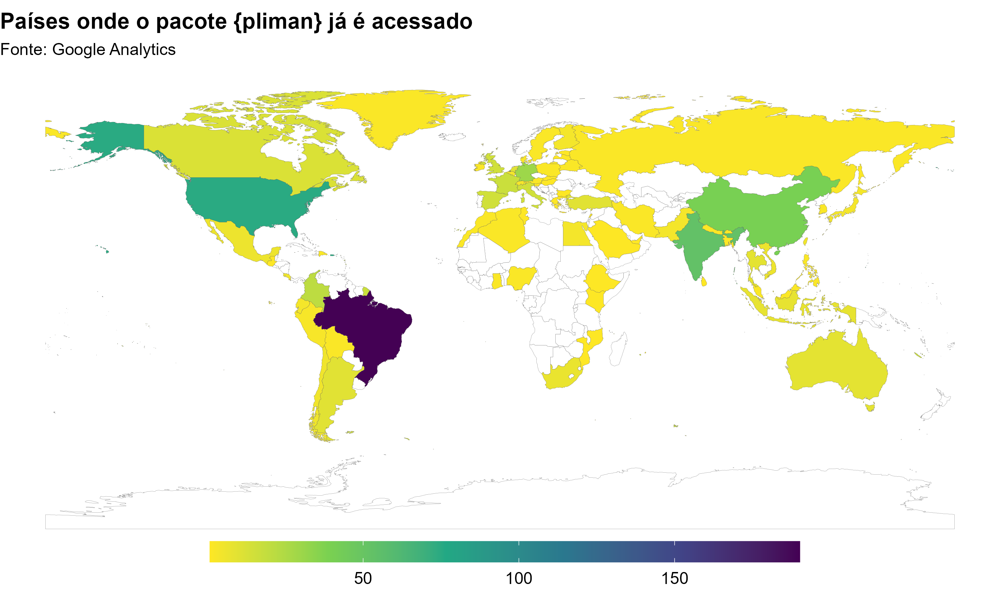
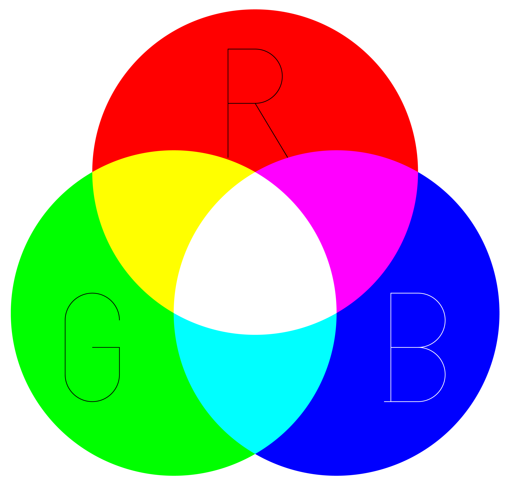
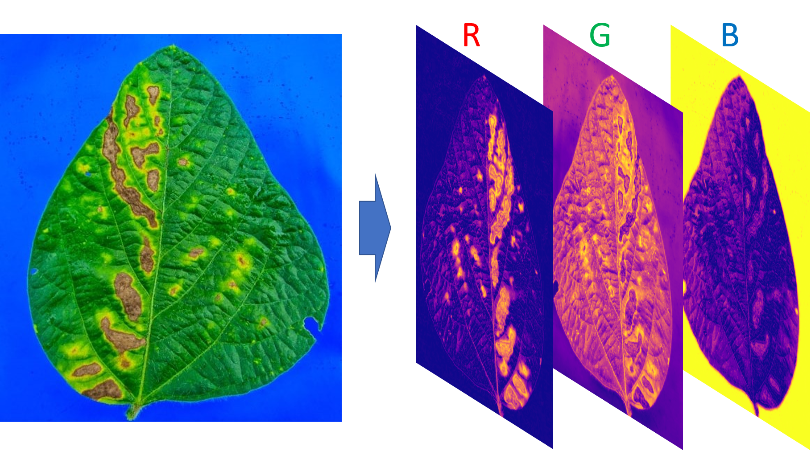
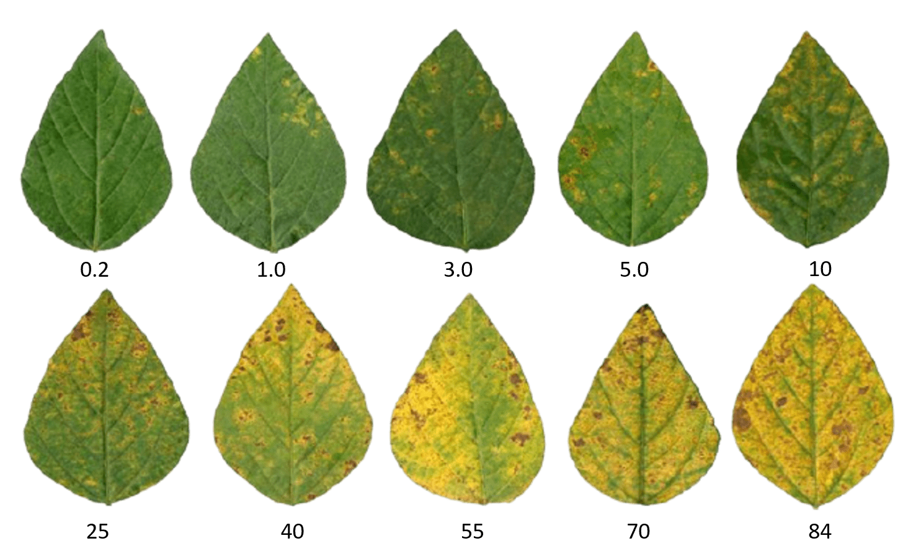
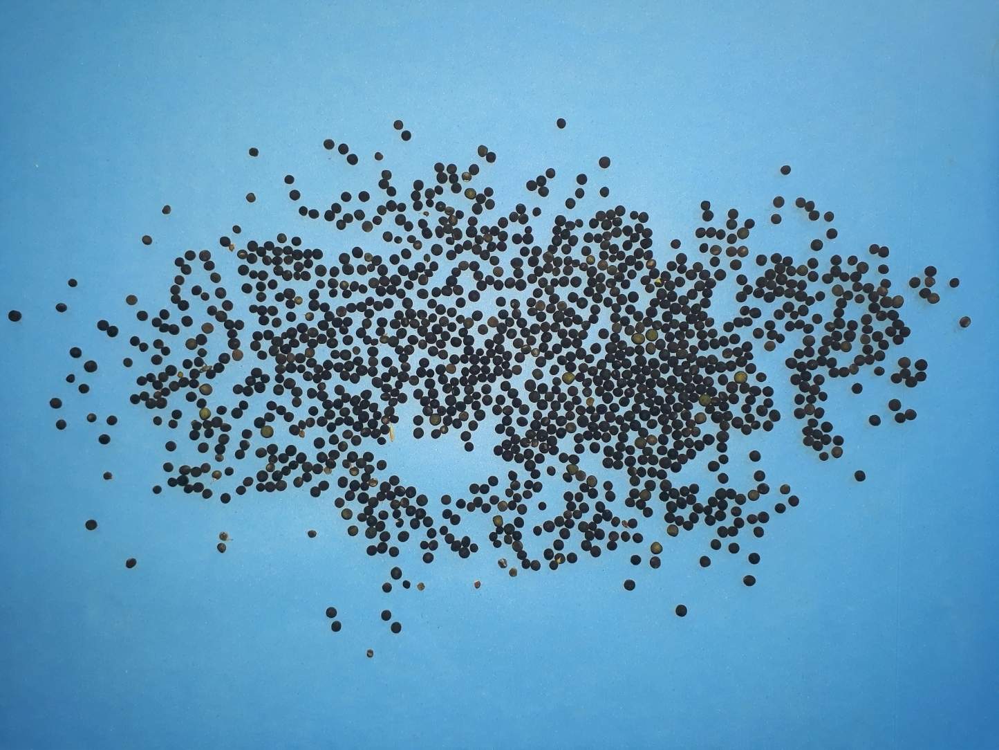

```{r, write_author_css, include = FALSE}
source("config/custom_css.R")
source("config/setup.R")
knitr::opts_chunk$set(out.width = "100%",
                      dev = "svg",
                      # cache = TRUE,
                      dev.args = list(family = "Roboto Condensed",
                                      bg = NA))

# set xaringanExtra
xaringanExtra::use_animate_css() # use animation
xaringanExtra::use_panelset() # use pannels
xaringanExtra::use_search(show_icon = TRUE) # search buttom
xaringanExtra::style_search(match_background = "blue")
xaringanExtra::use_tachyons() 
xaringanExtra::style_share_again(
  share_buttons = c("all")
)
xaringanExtra::use_broadcast()
xaringanExtra::use_scribble()
```


# Motivação

* Automatização de processos   
* Severidade de doenças
* Número de objetos (grãos, folhas, etc.)
* Forma dos objetos
* Software gratuito/open-source
* Processamento em lote
* Paralelização
* Reprodutibilidade


---

# <i class="fas fa-glasses"></i> O pacote {pliman}


{pliman} (**pl**ant **im**age **an**alysis) foi concebido para analisar (também) imagens de plantas, especialmente relacionadas à análise de folhas e sementes.  O pacote irá ajudá-lo a:

* Mensurar a severidade de doenças foliares;
* Contar o número de lesões;
* Obter características da forma das lesões;
* Contar objetos em uma imagem;
* Obter características de objetos (área, perímetro, raio, circularidade, excentricidade, solidez);
* Obter os valores RGB para cada objeto em uma imagem;
* Obter as coordenadas de objetos;
* Obter os contornos de objetos;
* Obter o *convex hull*;
* Isolar objetos;
* Plotar medidas de objetos.


---
# <i class="fas fa-glasses"></i> Workflow do pacote {pliman}


```{r, out.width='85%', echo = FALSE, fig.cap=""}
knitr::include_graphics('figs/workflow_pliman.png')
```


---

# <i class="fas fa-glasses"></i> Abrangência

.lc-80[
```{r, out.width='90%', echo = FALSE}

```

]

.rc-20[
```{r, out.width='100%', echo = FALSE}

```

[Site do pacote](https://tiagoolivoto.github.io/pliman/)
]


---

# <i class="fa fa-book"></i> Referências


.lc-50[
```{r, out.width='60%', echo = FALSE}
knitr::include_graphics('figs/paper_mee.png')
```
<i class="fa fa-book"></i>Veja o artigo [aqui](https://www.researchgate.net/publication/357909074_Lights_camera_pliman_An_R_package_for_plant_image_analysis)
]

.rc-50[
```{r, out.width='60%', echo = FALSE}
knitr::include_graphics('figs/paper_tpp.png')
```
<i class="fa fa-book"></i>Veja o artigo [aqui](https://www.researchgate.net/publication/358646216_Measuring_plant_disease_severity_in_R_introducing_and_evaluating_the_pliman_package)
]


---
# Instalação

```{r eval=FALSE}
install.packages("pliman")
```

Ou instale a versão de desenvolvimento do pliman do [GitHub](https://github.com/TiagoOlivoto/pliman) com o comando abaixo. Note que o pacote `devtools` é necessário.

```{r, eval = FALSE}
# instalação do github
if(!require(devtools)){
  install.packages("devtools")
}
install_github ("TiagoOlivoto/pliman")

```

Depois de instalado, carregue o pacote com
```{r}
library(pliman)
```

.tiny[
.bg-transparent.b--blue.ba.bw2.br3.shadow-5.ph2.mt2[
Se você for um usuário do Windows, sugere-se primeiro baixar e instalar a versão mais recente do [Rtools](https://cran.r-project.org/bin/windows/Rtools/).
]
]


---

# Imagens são compostas por elementos de imagem (pixels)

```{r, out.width='70%', echo = FALSE, fig.cap=""}
knitr::include_graphics('figs/scheme_pixels.png')
```

---
# Imagens são interpretadas como matrizes (arrays)

.lc-50[
```{r, out.width='75%', echo = TRUE, fig.cap=""}
img <- image_pliman("sev_leaf.jpg")
dim(img)
pixels <- img@.Data[1:3, 1:3, 1:2]
pixels
```
]

.rc-50[
```{r out.width='75%'}
plot(img)
```

]


---
# O espaço de cores RGB
```{r, out.width='40%', echo = FALSE}

```

Fonte: https://bit.ly/3AKlIOQ


---
# O espaço de cores RGB

```{r, out.width='80%', echo = FALSE, fig.cap=""}

```


---
# Binarização
.lc-50[
```{r segmentation, out.width="80%"}
soy <- image_pliman("soybean_touch.jpg", plot = TRUE)

```
]

.rc-50[
```{r segmentation1, out.width="80%"}
image_binary(soy, ncol = 2)
```
]


---

## Desafio

### Qual a *severidade* estimada na imagem abaixo?

.lc-30[
```{r, out.width='80%', echo = FALSE}
knitr::include_graphics('figs/soybean_rust.png')
```

]

--

.rc-70[
```{r, out.width='90%', echo = FALSE, fig.cap="Diagramas de área padrão para ferrugem da soja (Franceschi et al. 2020)"}

```


]


---
## Thresholding (limiar)


.panelset.sideways.left[
.panel[.panel-name[Aquisição da imagem]
```{r, out.width='65%'}
sev <- image_pliman("sev_leaf.jpg", plot = TRUE)
```

]

.panel[.panel-name[Thresholding]

.lc-50[
* Densidade dos valores de **B**
```{r out.width='90%'}
ind <-
  image_index(sev,
              index = "B",
              show_image = FALSE)
plot(ind, type = "density")

```

]


.rc-50[
* Gráfico *Raster*
```{r, out.width='90%'}
plot(ind, type = "raster")
```

]
]


.panel[.panel-name[Segmentação]
.lc-50[
```{r, out.width='100%'}
image_index(sev, index = "B")
```

]
.rc-50[
```{r, out.width='100%'}
image_segment(sev, index = "B")
```
]

]

.panel[.panel-name[Índices para segmentação]
```{r echo=FALSE}
library(DT)
# Function to make HTML tables

print_table <- function(table, rownames = FALSE, digits = 3, ...){
  datatable(table, rownames = rownames, extensions = 'Buttons',
            options = list(scrollX = TRUE,
                           dom = '<<t>Bp>',
                           buttons = c('copy', 'excel', 'print')), ...)}

ind <- read.csv(file = system.file("indexes.csv",
                                   package = "pliman",
                                   mustWork = TRUE),
                header = T,
                sep = ";")
print_table(ind[,1:2])
```

]


.panel[.panel-name[Escolha do índice]
```{r, out.width='100%', fig.width=20, fig.height=13}
image_segment(sev, index = "all", ncol = 6)
```

]


.panel[.panel-name[Imagem segmentada]

.lc-33[
```{r, out.width='100%'}
image_segment(
  sev,
  index = "NB",
  threshold = 0.3
)
```

]
.lc-33[
```{r, out.width='100%'}
image_segment(
  sev,
  index = "NB",
  threshold = 0.5
)
```

]
.lc-33[
```{r, out.width='100%'}
image_segment(
  sev,
  index = "NB",
  threshold = 0.7
)
```

]


* Quando `threshold` é igual a `NULL` (padrão), o método de Otsu (1979) é aplicado.

.tiny[
.bg-transparent.b--blue.ba.bw2.br3.shadow-5.ph2.mt2[
*An optimal threshold is selected by the discriminant criterion, namely, so as to maximize the separability of the resultant classes in gray levels* (Outsu, 1979)
]
]
]
]


---

## Aplicação

```{r fig.width=20, out.width='90%'}
image_segment_iter(sev,
                   nseg = 2,
                   index = c("NB", "GLI"),
                   ncol = 3,
                   threshold = c("Otsu", 0.2))
```


---
.lc-50[
# Imagem original
```{r, out.width='50%', echo = FALSE}
knitr::include_graphics('figs/soybean_rust.png')
```

]

.rc-50[
# Imagem processada
```{r, out.width='50%', echo = FALSE, fig.cap="Severidade estimada: 17,69%"}
knitr::include_graphics('figs/soybean_rust_mask.png')
```

]


---

.lc-50[
# Contagem de objetos
```{r, out.width='85%', echo = FALSE}
img <- image_import("figs/vicia.jpg")


```
]

--

.rc-50[
```{r, out.width='85%'}
vicia <- analyze_objects(img, index = "B")
vicia$statistics[1,]
```
]


---
.lc-50[
# Área foliar
```{r, out.width='80%', echo = FALSE}
la <- image_import("figs/leaves.jpg", plot = TRUE)

```
]

--

.rc-50[
```{r, out.width='80%'}
la_res <-
  analyze_objects(la,
                  watershed = FALSE,
                  marker = "area",
                  col_background = "blue")
area <- get_measures(la_res, dpi = 72)
plot_measures(area,
              measure = "area",
              vjust = -30)
```
]


---
# Propriedades de objetos

.lc-50[
```{r out.width="75%", echo=T}
bean <- image_import("figs/bean.jpg", plot = TRUE)
```
]

.rc-50[
```{r out.width="80%", echo=TRUE}
bean2_meas <- 
  analyze_objects(bean,
                  index = "G",
                  fill_hull = TRUE,
                  watershed = FALSE,
                  show_image = FALSE,
                  contour_col = "white",
                  col_background = "black")

```


```{r out.width="75%", echo=FALSE}
bean2_meas <- 
  analyze_objects(bean,
                  index = "G",
                  fill_hull = TRUE,
                  watershed = FALSE,
                  contour_col = "white",
                  col_background = "black")
# contour
cont <- object_contour(bean,
                       index = "G",
                       watershed = FALSE,
                       show_image = FALSE)
# smooth the perimeter with fewer vertices (50)
sp <- poly_spline(cont, vertices = 50)
plot_contour(sp, col = "white", lwd = 2)

# center of mass
cm <- poly_mass(sp)
plot_mass(cm,
          col = "white",
          arrow = TRUE)
meas <- get_measures(bean2_meas, dpi = 300)
plot_measures(meas, measure = "diam_min", vjust = 50)
plot_measures(meas, measure = "diam_max", hjust = 50)
plot_measures(meas, measure = "id", hjust = -100, vjust = 100, col = "red")
```


]


---
# Propriedades de objetos

.lc-50[
```{r out.width="75%", echo=T}
root <- image_import("figs/root.jpg", plot = T)
```
]

.rc-50[
```{r out.width="75%", echo=T}
r1_meas <- 
  analyze_objects(root, index = "B", invert = TRUE,
                  tolerance = 3, lower_eccent = 0.95)
r1_meas_cor <- get_measures(r1_meas, dpi = 150)
r1_meas_cor$metade_perimetro = r1_meas_cor$perimeter / 2
plot_measures(r1_meas_cor, measure = "metade_perimetro")
```
]


---
# RGB para cada objeto

.lc-50[
```{r out.width="75%", echo=T}
esverdeado <- image_import("figs/esverdeado.jpg", plot = T)
```
]

.rc-50[
```{r out.width="75%", echo=T}
rgb_soja <- 
  analyze_objects(esverdeado,
                  index = "S",
                  invert = TRUE,
                  object_index = "G")
plot_measures(rgb_soja,
              measure = "G", # plot the mean of blue values for each object
              col = "black")
```
]


---
class: center

# Análise de imagens no software R utilizando o pacote {pliman}


.lc-50[

<center>
</center>

<i class="far fa-envelope"></i> [tiago.olivoto@ufsc.com](mailto:tiago.olivoto@ufsc.com)<br>
<i class="far fa-envelope"></i> [tiagoolivoto@gmail.com](mailto:tiagoolivoto@gmail.com)<br>
<i class="fas fa-home"></i> [olivoto.netlify.app](https://olivoto.netlify.app/)<br>
<i class="ai ai-lattes ai"></i>[Lattes](http://lattes.cnpq.br/2432360896340086)<br>
<i class="ai ai-google-scholar ai"></i>[Scholar](https://scholar.google.com/citations?user=QjxIJkcAAAAJ&hl=pt-BR)<br>
<i class="ai ai-researchgate ai"></i>[Research Gate](https://www.researchgate.net/profile/Tiago_Olivoto2)<br>
<i class="fab fa-twitter"></i> [@tolivoto](https://twitter.com/tolivoto)<br>
<i class="fab fa-github-square"></i> [GitHub](https://github.com/TiagoOlivoto)

]

.rc-50[


Slides criados usando os 📦 R:
.tiny[
[**xaringan**](https://github.com/yihui/xaringan)<br>
[**xaringanthemer**](https://github.com/gadenbuie/xaringanthemer)<br>
[**xaringanExtra**](https://github.com/gadenbuie/xaringanExtra)<br>
[**knitr**](http://yihui.name/knitr)<br>
[**R Markdown**](https://rmarkdown.rstudio.com) <br>
<i class="fas fa-code"></i> Código disponível no [GitHub](https://github.com/TiagoOlivoto/slides_R)
]


.tiny[
.bg-transparent.b--blue.ba.bw2.br3.shadow-5.ph2.mt2[
*“Se você for curioso, independentemente de gênero, raça e extrato social, então pode ser um cientista.”*
.tr[
— [Barbara McClinton](http://usp.br/cienciaweb/2019/05/barbara-mcclintock-o-milho-e-o-premio-nobel/)
]
]
]
]


<!-- inicio academic icons -->
<link rel="stylesheet" href="https://cdn.jsdelivr.net/gh/jpswalsh/academicons@1/css/academicons.min.css">
<!-- final academic icons -->


<!-- inicio font awesome -->
<script src="https://kit.fontawesome.com/1f72d6921a.js" crossorigin="anonymous"></script>
