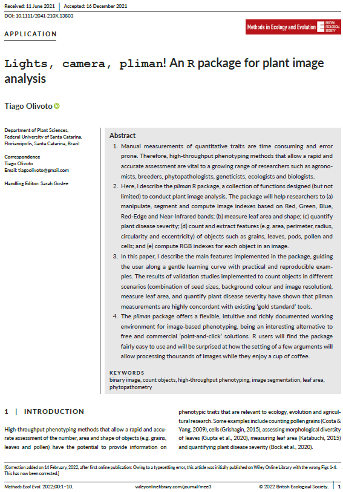
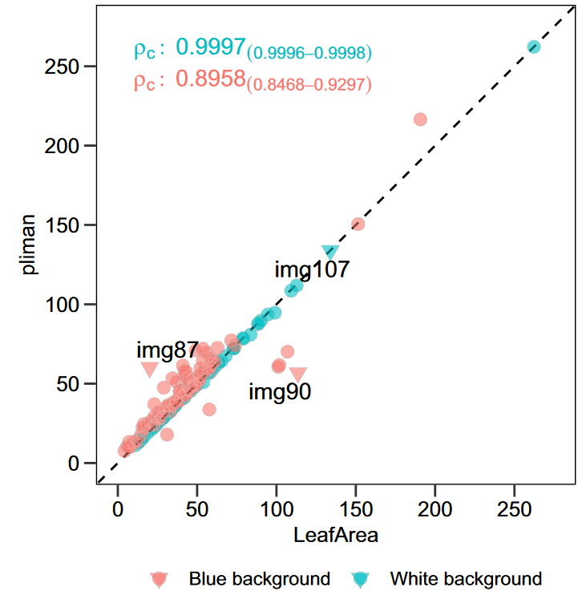

```{r, write_author_css, include = FALSE}
source("config/custom_css.R")
source("config/setup.R")
knitr::opts_chunk$set(out.width = "100%",
                      dev = "svg",
                      # cache = TRUE,
                      dev.args = list(family = "Roboto Condensed",
                                      bg = NA))

# set xaringanExtra
xaringanExtra::use_animate_css() # use animation
xaringanExtra::use_panelset() # use pannels
xaringanExtra::use_search(show_icon = TRUE) # search buttom
xaringanExtra::style_search(match_background = "blue")
xaringanExtra::use_tachyons() 
xaringanExtra::style_share_again(
  share_buttons = c("all")
)
xaringanExtra::use_broadcast()
xaringanExtra::use_scribble()

```


```{r xaringanExtra, echo = FALSE}
xaringanExtra::use_progress_bar(color = "#0051BA", location = "bottom")
```

# O problema

.lc-70[
```{r, out.width='55%', echo = FALSE}
knitr::include_graphics('figs/soy_leaf.png')
```

]
.rc-30[
* Qual a área 'lesionada' do folíolo?
* Qual é a área do folíolo?
* Quantos folíolos preciso analizar?
]


---

# Existe uma importante lacuna a ser preenchida?
.lc-30[
* De um a três minutos por imagem
* Baixa escala na coleta de dados
* E a manipulação dos dados?
* E a análise dos dados?
* E a apresentação dos dados?
]

.rc-70[
```{r, out.width='85%', echo = FALSE}
knitr::include_graphics('figs/quant.png')
```

]


---
# O que tem sido feito?

.lc-50[
* ImageJ (Grátis e de código aberto)
* APS Assess ($295.00)
- Sessão iterativa

* Easy Leaf Area (Python)
* Lamina (Java)
* LeafArea (R)
- E com relação ao número e forma das folhas?

* **Por que não mensurar, analisar dados e exibir os resultados em um único software?**
]


.rc-50[
```{r, out.width='83%', echo = FALSE}
knitr::include_graphics('figs/softwares.png')
```

]


---

# Como podemos preencher a lacuna existente?
## Imagens digitais são compostas por elementos de imagem (pixels)

```{r, out.width='60%', echo = FALSE, fig.cap=""}
knitr::include_graphics('figs/scheme_pixels.png')
```


---
# O espaço de cores RGB

```{r, out.width='85%', echo = FALSE, fig.cap=""}
knitr::include_graphics('figs/scheme_rgb_leaf.png')
```


---
# Imagens são interpretadas como arrays

.lc-50[
```{r, out.width='75%', echo = TRUE, fig.cap=""}
library(pliman)
img <- image_pliman("sev_leaf.jpg")
dim(img)
(pixels <- img@.Data[1:2, 1:2, 1:3])
```
]

.rc-50[
```{r out.width='80%'}
plot(img)
```
]


---
# Arrays podem ser manipulados no R!


.panelset.sideways.left[
.panel[.panel-name[Importação]
```{r, out.width='65%'}
sev <- image_pliman("sev_leaf.jpg", plot = TRUE)
```

]

.panel[.panel-name[Thresholding]

.lc-50[
* Gráfico de densidade (**B**)
```{r out.width='85%'}
ind <- image_index(sev,
                   index = "B",
                   show_image = FALSE)
plot(ind, type = "density")

```

]


.rc-50[
* Um gráfico *Raster*
```{r, out.width='90%'}
plot(ind, type = "raster")
```

]
]


.panel[.panel-name[Segmentação]
.lc-50[
```{r, out.width='100%'}
image_index(sev, index = "B")
```

]
.rc-50[
```{r, out.width='100%'}
image_segment(sev, index = "B")
```
]

]

.panel[.panel-name[Índices para segmentação]
```{r echo=FALSE}
library(DT)
# Function to make HTML tables

print_table <- function(table, rownames = FALSE, digits = 3, ...){
  datatable(table, rownames = rownames, extensions = 'Buttons',
            options = list(scrollX = TRUE,
                           pageLength = 6,
                           dom = '<<t>Bp>',
                           buttons = c('copy', 'excel', 'print')), ...)}

ind <- read.csv(file = system.file("indexes.csv",
                                   package = "pliman",
                                   mustWork = TRUE),
                header = T,
                sep = ";")
print_table(ind[,1:2])
```

]


.panel[.panel-name[Escolhendo um índice]
```{r, out.width='100%', fig.width=20, fig.height=10}
sev |> image_horizontal() |> image_index("all")
```
]

.panel[.panel-name[Identificando a segmentação]
```{r, out.width='100%', fig.width=20, fig.height=10}
sev |> image_horizontal() |> image_segment("all")
```
]


.panel[.panel-name[Imagem segmentada]

.lc-33[
```{r, out.width='100%'}
image_segment(
  sev,
  index = "NB",
  threshold = 0.3
)
```

]
.lc-33[
```{r, out.width='100%'}
image_segment(
  sev,
  index = "NB",
  threshold = 0.5
)
```

]
.lc-33[
```{r, out.width='100%'}
image_segment(
  sev,
  index = "NB",
  threshold = 0.7
)
```

]


* Quando `threshold` é `NULL` (default), o método de Otsu (1979) é usado.

.tiny[
.bg-transparent.b--blue.ba.bw2.br3.shadow-5.ph2.mt2[
*An optimal threshold is selected by the discriminant criterion, namely, so as to maximize the separability of the resultant classes in gray levels* (Outsu, 1979)
]
]
]
]


---
# <i class="fas fa-glasses"></i> O pipeline do pacote


```{r, out.width='85%', echo = FALSE, fig.cap=""}
knitr::include_graphics('figs/workflow_pliman.png')
```


---

# <i class="fa fa-book"></i> Referências


.lc-50[
```{r, out.width='60%', echo = FALSE}

```
<i class="fa fa-book"></i>Veja o artigo aqui! [aqui](https://besjournals.onlinelibrary.wiley.com/doi/abs/10.1111/2041-210X.13803)
]

.rc-50[
```{r, out.width='60%', echo = FALSE}
knitr::include_graphics('figs/paper_tpp.png')
```
<i class="fa fa-book"></i>Veja o artigo aqui! [aqui](https://link.springer.com/article/10.1007/s40858-021-00487-5)
]

---
class: center

<a href="https://tiagoolivoto.github.io/pliman_tut/00_about.html"><i class="fas fa-laptop-code fa-10x"></i>

.HUGE[
**Aplicações**
]


---
.lc-50[
# Fitopatometria (severidade)
```{r, out.width='85%', echo = TRUE}
vid <- image_import("figs/videira.png",
                    plot = TRUE)

```

]

--
.rc-50[
```{r, out.width='80%', echo=TRUE}
sev <- 
  measure_disease(vid,
                  index_lb = "G",
                  index_dh = "G-R",
                  show_segmentation = TRUE)
sev$severity
```

]


---
.lc-50[
# Fitopatometria (crescimento micelial)
```{r, out.width='70%', echo = TRUE}
fungo <- 
  image_import("figs/fungo.jpeg",
               plot = TRUE)

```

]

--
.rc-50[
```{r, out.width='70%', echo = TRUE}
res <- 
  analyze_objects(fungo, 
                  index = "HUE",
                  invert = TRUE,
                  filter = 5,
                  watershed = FALSE,
                  contour_size = 6)
get_measures(res, dpi = 90) |> 
  plot_measures(measure = "area", 
                col = "black",
                size = 2)
```

]


---
# Acurácia nas mensurações

```{r, out.width='70%', echo = FALSE, fig.cap="Linha de perfeita igualidade entre medidas obtidas pelo pliman e severidade 'real'."}


```

.footnote[Fonte: Olivoto et al. (2022)]


---

.lc-50[
# Contagem de objetos (sementes de ervilhaca)
```{r, out.width='85%', echo = TRUE}
img <- image_import("figs/vicia.jpg", plot = TRUE)

```
]

--
.rc-50[
```{r, out.width='85%'}
vicia <- analyze_objects(img, index = "B")
vicia$statistics[1,]
```
]


---

.lc-50[
# Contagem de objetos (células)

.footnote[Imagem: https://www.youtube.com/watch?v=PqHFsmS1_JY]

```{r, out.width='80%', echo = TRUE}
cell <- image_import("figs/cell.jpg", plot = TRUE)

```
]


--
.rc-50[
```{r, out.width='80%'}
tmp <- 
  analyze_objects(cell,
                  index = "G",
                  invert = TRUE, 
                  show_segmentation = TRUE)

tmp$statistics[1,]
```
]


---
# Acurácia nas mensurações

```{r, out.width='50%', echo = FALSE, fig.cap="Linha de perfeita igualidade para contagem de objetos."}


```

.footnote[Fonte: Olivoto et al. (2022b)]


---
.lc-50[
# Área foliar
```{r, out.width='80%', echo = FALSE}
la <- image_import("figs/leaves.jpg", plot = TRUE)

```
]

--

.rc-50[
```{r, out.width='80%'}
la_res <-
  analyze_objects(la,
                  watershed = FALSE,
                  marker = "area",
                  col_background = "blue")
area <- get_measures(la_res, dpi = 50.7)
plot_measures(area, measure = "area", size = 1.5, vjust = -30)
```
]


---
.lc-50[
# Acurácia nas medições de área foliar
```{r, out.width='75%', echo = FALSE, fig.cap="Pliman vs LeafArea"}


```
]

--

.rc-50[
# Em quanto tempo eu tenho as medidas?
```{r, out.width='75%', echo = FALSE, fig.cap="Tempo de processamento"}
knitr::include_graphics('figs/time.png')
```

]

.footnote[Fonte: Olivoto et al. (2022b)]


---
# Fexibilidade (diferentes backgrounds, etc...)

```{r, out.width='70%', echo = FALSE, fig.cap="LeafArea vs pliman."}


```

.footnote[Fonte: Olivoto et al. (2022b)]


---
.lc-50[
# Comprimento, largura, perímetro...
```{r, out.width='85%', echo = FALSE}
fla <- image_import("figs/flax.jpg", plot = TRUE) |> image_resize(50)

```
]

--

.rc-50[
```{r, out.width='85%'}
res <- 
  analyze_objects(fla, 
                  reference = TRUE,
                  reference_area = 20,
                  marker = "length")
```

]


---
# Quantas medidas podemos obter?

```{r echo=FALSE}
apply(res$results, 2, round, digits = 2) |> print_table()
```

.Huge[... e contando.]


---
# É possível qualificar os objetos?

.lc-50[
```{r out.width="75%", echo=T}
esverdeado <- image_import("figs/esverdeado.jpg", plot = T)
```
]

--
.rc-50[
```{r out.width="75%", eval=FALSE}
rgb_soja <-
  analyze_objects(esverdeado,
                  object_index = "B")

```

```{r out.width="75%", echo=FALSE}
rgb_soja <-
  analyze_objects(esverdeado,
                  object_index = "B")
plot_measures(rgb_soja, measure = "B")
indexes <- summary_index(rgb_soja, index = "B", cut_point = 0.3)
cont <- object_contour(esverdeado, show_image = FALSE)
plot_contour(cont, id = indexes$ids, color = "black", lwd = 2)
```

]


---
# Estado nutricional de plantas?

```{r out.width="50%", eval=FALSE}

fla <- image_import("figs/flax.jpg") |> image_resize(50)
lin <-  analyze_objects(fla,  reference = TRUE, reference_area = 20, object_index = "DGCI")
plot_measures(lin, measure = "DGCI")
```


```{r out.width="50%", echo=FALSE}
fla <- image_import("figs/flax.jpg") |> image_resize(50)
lin <-  analyze_objects(fla,  reference = TRUE, reference_area = 20, object_index = "DGCI")
plot_measures(lin, measure = "DGCI")
```


---
# Descritor de Fourier (em andamento...)

```{r out.width="85%", echo=FALSE, fig.cap="Aproximação da forma de objetos utilizando coeficientes de Fourier"}

```


---
# Descritor de Fourier para diversidade fenotípica

```{r out.width="60%", echo=FALSE}

```


---
# Dicas rápidas

```{r out.width="100%", echo=FALSE}

```

* Background complexo (a)   
* Gradientes de luminosidade (b)   
* Subexposição (c)  
* Áreas sombreadas (d)
* Situação indicada (e)

---
.lc-50[
# A lacuna está definitivamente preenchida?

* Ainda ha um longo caminho a percorrer!
* Threshold adaptativo?
* Segmentação semântica?
* Redes Neurais Convolucionais?

]

.rc-50[
# Desafios
```{r, out.width='90%', echo = FALSE}

```

]

---
class: center
# Mais aplicações neste vídeo

<center>
<iframe width="860" height="486" src="https://www.youtube.com/embed/JDqRUrTKYTI" title="YouTube video player" frameborder="0" allow="accelerometer; autoplay; clipboard-write; encrypted-media; gyroscope; picture-in-picture" allowfullscreen></iframe>
</center>


---
class: center

# Luz, câmera {pliman}! Um pacote R para análise de imagens de plantas

.lc-50[

<center>
</center>

<i class="far fa-envelope"></i> [tiago.olivoto@ufsc.com](mailto:tiago.olivoto@ufsc.com)<br>
<i class="far fa-envelope"></i> [tiagoolivoto@gmail.com](mailto:tiagoolivoto@gmail.com)<br>
<i class="fas fa-home"></i> [olivoto.netlify.app](https://olivoto.netlify.app/)<br>
<i class="ai ai-lattes ai"></i>[Lattes](http://lattes.cnpq.br/2432360896340086)<br>
<i class="ai ai-google-scholar ai"></i>[Scholar](https://scholar.google.com/citations?user=QjxIJkcAAAAJ&hl=pt-BR)<br>
<i class="ai ai-researchgate ai"></i>[Research Gate](https://www.researchgate.net/profile/Tiago_Olivoto2)<br>
<i class="fab fa-twitter"></i> [@tolivoto](https://twitter.com/tolivoto)<br>
<i class="fab fa-github-square"></i> [GitHub](https://github.com/TiagoOlivoto)

]

.rc-50[

.huge[
Obrigado!
]


Slides feitos com os 📦 R
.tiny[
[**xaringan**](https://github.com/yihui/xaringan)<br>
[**xaringanthemer**](https://github.com/gadenbuie/xaringanthemer)<br>
[**xaringanExtra**](https://github.com/gadenbuie/xaringanExtra)<br>
[**knitr**](http://yihui.name/knitr)<br>
[**R Markdown**](https://rmarkdown.rstudio.com) <br>
<i class="fas fa-code"></i> Veja o códígo usado em [GitHub](https://github.com/TiagoOlivoto/slides_R)
]


.tiny[
.bg-transparent.b--blue.ba.bw2.br3.shadow-5.ph2.mt2[
*“Se você é curioso, independentemente de gênero, raça e estrato social, pode ser um cientista.”*
.tr[
— [Barbara McClinton](http://usp.br/cienciaweb/2019/05/barbara-mcclintock-o-milho-e-o-premio-nobel/)
]
]
]
]


<!-- inicio academic icons -->
<link rel="stylesheet" href="https://cdn.jsdelivr.net/gh/jpswalsh/academicons@1/css/academicons.min.css">
<!-- final academic icons -->


<!-- inicio font awesome -->
<script src="https://kit.fontawesome.com/1f72d6921a.js" crossorigin="anonymous"></script>
